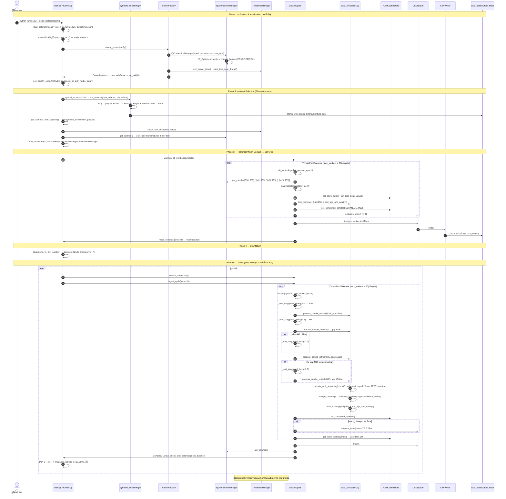

# 📥 FINALBOT — กระบวนการทำงานของบอท ส่วนที่ 1: INPUT (Data Feed System)

> 📅 **เอกสารฉบับนี้ตรวจสอบเทียบบรรทัดต่อบรรทัดกับ source code จริง ณ commit `a603b52` (22 ก.ย. 2026)**
> ทุกตัวเลข ทุก path ทุกชื่อฟังก์ชันในเอกสารนี้ มีเลขบรรทัดกำกับไว้ให้ตรวจย้อนกลับได้เสมอ
> หากโค้ดกับเอกสารขัดกัน ให้ยึด **โค้ด** เป็นหลัก แล้วกลับมาแก้เอกสารนี้

---

## 🎯 ทำความเข้าใจได้ทันที (Executive Summary)

ส่วนงานที่ 1 (**INPUT / Data Feed System**) คือ **"ระบบท่อส่งข้อมูลตลาดแบบ Real-time"** มีหน้าที่:

1. เชื่อมต่อโบรกเกอร์ (ปัจจุบันใช้งานจริงเฉพาะ **IQ Option**) และ login ด้วย credential จาก `config_setting/settings.json`
2. ซิงค์เวลาเซิร์ฟเวอร์โบรกเกอร์ คำนวณ `time_offset` และ resync อัตโนมัติทุกนาที ณ วินาทีที่ `:30`
3. warm-up แท่งเทียนย้อนหลัง **255 แท่ง** ต่อ timeframe แล้วตัดแท่งที่กำลังฟอร์มตัวออก เหลือ **250 แท่งสมบูรณ์**
4. ตรวจสอบความถูกต้องของข้อมูลทุกชั้น (NaN / ค่าลบ / high<low / price continuity / overlap / data gap / sanity range)
5. เก็บแท่งเทียนสมบูรณ์ไว้ใน **RAM Cache** แยก 2 ระดับ (raw store + completed candles)
6. เขียนลงดิสก์เป็นไฟล์ **CSV 8 คอลัมน์** แบบ thread-safe atomic write ผ่าน background queue
7. ส่งมอบไฟล์ CSV ให้ **ส่วนงานที่ 2 (PROCESS / Data Evaluate)** อ่านจากดิสก์เท่านั้น (Decoupling)

```
┌────────────────────────────────────────────────────────────────────────────────────────────────────┐
│                          ขอบเขตและสัญญาของส่วนงานที่ 1 (Contract)                                  │
├───────────────────────────────┬────────────────────────────────┬───────────────────────────────────┤
│         จุดเริ่มต้น           │      แกนกลางการประมวลผล        │      จุดสิ้นสุดการส่งมอบ         │
├───────────────────────────────┼────────────────────────────────┼───────────────────────────────────┤
│ • โหลด settings.json          │ • REST + WebSocket (lazy)      │ • CSV 8 คอลัมน์ 250 แถว           │
│ • Login IQ Option             │ • Staggered fetch              │   data_base/output_feed/<SYM>/    │
│ • sync เวลาเซิร์ฟเวอร์         │   S30 :00.8 / M1 :01.5         │ • RAM Cache (Zero Disk I/O)       │
│ • คัดคู่เงิน (Phase 0)        │   M5 :02.0 / M15 :02.5         │ • logs/logs_data_feed/            │
│ • warm-up 255 → 250 แท่ง      │ • validate + drop_forming      │   (errors/warnings/fallback)      │
│                               │ • age & quality                │ • Console (ภาษาไทย, รายนาที)     │
│                               │ • enqueue → atomic CSV write   │                                   │
└───────────────────────────────┴────────────────────────────────┴───────────────────────────────────┘
```

> ⚠️ **ปฏิทินข่าวเศรษฐกิจไม่ใช่งานของ Part 1** — `news_calendar.py` อยู่ที่ `data_evaluate/<mode>/` และถูกเรียกจาก
> `Orchestrator.__init__()` ของ **Part 2** (`data_evaluate/strategies_mode/orchestrator.py:49, 113`)

---

## ⏱️ Timeframe ที่ Part 1 ดึงจริง (ขึ้นกับ `active_mode`)

| `active_mode` | Timeframe ที่ดึง | จำนวนแท่ง | แหล่ง config |
|:---|:---|:---:|:---|
| **`strategies_mode`** (ค่าปัจจุบัน) | **S30, M1, M5** | 250/TF | `settings.json → data_feed.data_adapter.strategies_timeframes = ["S30","M1","M5"]`<br>`strategies_enable_m15 = false` |
| `ml_mode` / `ai_mode` | **S30, M1, M5, M15** | 250/TF | `skip_m15_for_strategy = False` (`data_adapter.py:116`) |

ตรรกะในโค้ด (`data_adapter.py:109-116`):
```python
self.active_mode            = str(config.get("active_mode", "")).lower()
self.strategy_timeframes    = tuple(adapter_config.get("strategies_timeframes", ("S30","M1","M5")))
self.strategy_mode          = self.active_mode == "strategies_mode"
self.strategy_m15_enabled   = bool(adapter_config.get("strategies_enable_m15", False))
self.skip_m15_for_strategy  = self.strategy_mode and not self.strategy_m15_enabled
```

> 📌 **S30 ถูกดึงเสมอทุกโหมด** — `init_symbol()` เรียก `get_candles(symbol,'S30',255,...)` แบบไม่มีเงื่อนไข (`data_adapter.py:181`)
> ส่วน M15 จะข้ามเมื่อ `skip_m15_for_strategy == True` (`data_adapter.py:184`)

**Timeframe → ขนาดวินาทีที่ IQ Option รองรับ** (`rest_fetcher.py:22-32`):
```python
_TF_SECONDS = {'S30':30, 'M1':60, 'M5':300, 'M15':900, 'M30':1800, 'M60':3600, 'H1':3600, 'H4':14400, 'D1':86400}
```

---

## 🏛️ สถาปัตยกรรมและหลักการออกแบบ (Architecture & Principles)

### 1. Single Source of Truth via CSV

- ไฟล์ CSV คือแหล่งความจริงหนึ่งเดียวของข้อมูลดิบระหว่าง Part 1 → Part 2
- **path จริง:**
  ```
  data_base/output_feed/<SYMBOL>/<SYMBOL>_<TIMEFRAME>.csv
  ```
  ตัวอย่าง: `data_base/output_feed/EURUSD-OTC/EURUSD-OTC_M1.csv`
- สร้างโดย `CSVManager.get_file_path()` (`csv_manager.py:49-79`):
  ```python
  full_path = os.path.join(self.base_dir, symbol_folder, filename)
  # base_dir       = "data_base/output_feed"      ← จาก settings.json → data_feed.csv_manager.base_dir
  # symbol_folder  = symbol (คงชื่อเดิม เช่น EURUSD-OTC)
  # filename       = "{symbol}_{timeframe}.csv"   ← naming_convention
  ```
- ⚠️ **ไม่มี segment ชื่อโบรกเกอร์ใน path** และ **ไม่มีโฟลเดอร์ `data_base/csv/`** ในระบบ
- `CSVManager` มี path traversal protection: ปฏิเสธ `..`, `/`, `\` ใน symbol/timeframe (`csv_manager.py:56-60`)
- Part 2 อ่านไฟล์นี้ผ่าน `process_cycle()` ของ orchestrator โดยใช้ `get_csv_manager_config().base_dir` เดียวกัน
  (`data_evaluate/strategies_mode/orchestrator.py:189-193`) → **ทั้งสองฝั่งผูกกับ config ตัวเดียวกัน**

### 2. Zero RAM Data Leakage & Memory Isolation

`RAMCacheStore` (`data_cache_store.py:19-28`) แยกเก็บ 2 ระดับ:

| ระดับ | ตัวแปร | เก็บอะไร | ใช้ทำอะไร |
|:---|:---|:---|:---|
| **Raw Store** | `_store_s30`, `_store_m1`, `_store_m5`, `_store_m15` | ข้อมูลดิบจาก stream/REST **รวมแท่งที่กำลังฟอร์มตัว** | buffer สำหรับ merge รอบถัดไป |
| **Completed** | `_completed_candles[symbol][TF]` | แท่งที่ **ปิดสมบูรณ์แล้ว 250 แท่ง** + คอลัมน์ `age`/`quality` | ให้ Part 1 อ่านราคา (`get_latest_close`) และเขียน CSV |
| **Block tracker** | `_last_block_s30/m1/m5/m15` | เลขบล็อกเวลา Terakhirที่ดึงต่อ symbol | ตรวจว่า "บล็อกเปลี่ยน = มีแท่งปิดใหม่" |

- จำกัดขนาดด้วย `.tail(250)` ทุกครั้งทั้งใน `process_candle_refresh` (`data_processor.py:235`) และ `CSVWriter.write` (`csv_writer.py:153, 160`)
- `merge_candles()` เก็บ buffer `max_candles + 10` = 260 แท่งใน raw store (`data_processor.py:102`, เรียกจาก `process_candle_refresh:221-227`)
- `get_latest_close(symbol)` อ่าน `_store_m1` ก่อน (ได้ราคา live รวมแท่งกำลังฟอร์ม) ถ้าไม่มีจึง fallback ไป `_completed_candles['M1']` (`data_cache_store.py:201-230`)

### 3. Thread-Safe Asynchronous I/O

- งานเขียนดิสก์ถูกแยกออกจาก thread หลักโดยสิ้นเชิงผ่าน `CSVQueue` (daemon worker thread)
- `CSVWriter` ใช้ **per-file `RLock`** (`csv_writer.py:17-29`) ร่วมกับ **atomic `.tmp` → `os.replace`**
- ฝั่งอ่านใช้ `read_csv_safe()` ที่ล็อกไฟล์เดียวกัน → อ่าน/เขียนไม่ชนกัน (`csv_writer.py:32-47`)
- `CSVWriter` มี **listener hook** (`register_listener` / `unregister_listener`, `csv_writer.py:53-65`) — ปัจจุบันไม่มีโมดูลใดลงทะเบียน

---

## 🚨 กฎ Zero Tolerance — ฉบับที่บังคับใช้จริงในโค้ด

### กลไกบังคับ (Enforcement Points)

| กฎ | จุดบังคับในโค้ด | พฤติกรรม |
|:---|:---|:---|
| **Zero Retries (network)** | `data_adapter.py:121-127` | ถ้า `retry_attempts > 0` หรือ `retry_delay > 0` → `logger.error` + `raise RuntimeError("Zero Tolerance: retry mechanisms not allowed")` ทันทีตั้งแต่ `__init__` |
| **Zero Retries (connection)** | `connection.py:51-58` | ถ้า `iq_option_adapter.connection_retries > 0` → `raise RuntimeError` |
| **บังคับค่าเป็น 0** | `data_adapter.py:128-129` | `self.retry_attempts = 0` / `self.retry_delay = 0` hardcode ทับค่า config |
| **Data Gap → ระเบิด** | `data_processor.py:91-93` (`merge_candles`) | `raise DataGapError(f"FAIL-FAST: Data gap detected ... ({gap_sec}s > {gap_threshold}s)")` |
| **Update ล้ม → ระเบิด** | `data_adapter.py:403-407` | log "Zero Tolerance: stopping immediately - no retry allowed" แล้ว `raise DataFeedError` |
| **No Mock Data** | `rest_fetcher.py:142-149` | volume เป็น NaN → `raise`; ไม่มีคอลัมน์ volume → `raise`; non-OTC volume รวม = 0 → `raise` |
| **Sanity range** | `rest_fetcher.py:151-165` | JPY ต้องอยู่ 50–300, non-JPY ต้องอยู่ 0.3–10.0 (median close) มิฉะนั้น `raise ValueError` |
| **warm-up ไม่ได้สักคู่** | `data_adapter.py:502-503` | `raise RuntimeError("FAIL-FAST: Zero assets passed historical data warm-up")` |
| **balance ดึงไม่ได้** | `runner.py:149-154` | `raise RuntimeError("FAIL-FAST: Failed to get balance from broker API")` |

### เกณฑ์ Data Gap ต่อ Timeframe (`data_adapter.py:38-41`)

| Timeframe | ค่าคงที่ | เกณฑ์ | เทียบเท่า |
|:---:|:---|:---:|:---|
| S30 | `_S30_GAP_SEC` | **150 s** | > 2.5 นาที → ดึงใหม่ 200 แท่ง |
| M1 | `_M1_GAP_SEC` | **300 s** | > 5 นาที |
| M5 | `_M5_GAP_SEC` | **1500 s** | > 25 นาที |
| M15 | `_M15_GAP_SEC` | **4500 s** | > 75 นาที |

### ⚠️ ขอบเขตจริงของ Fail-Fast (สำคัญ — อ่านก่อน debug)

กฎ Fail-Fast ทำงาน **ภายใน `update()` / `init_symbol()`** แต่ที่ชั้น Commander มีการ catch ต่อ symbol:

| ชั้น | โค้ด | พฤติกรรมจริง |
|:---|:---|:---|
| `_ingest_single_symbol` | `data_adapter.py:561-569` | `except Exception → return None, str(e)` → **ไม่ raise ขึ้นไป** |
| `ingest_cycle` | `data_adapter.py:534-541` | ถ้าได้ `None` → `logger.warning("Ingest for X returned no price")` แล้ว**วนต่อคู่เงินอื่น** |
| `_warmup_single_symbol` | `data_adapter.py:507-514` | `except → return False, str(e)` → เข้า `failed_symbols` |
| `warmup_all_symbols` | `data_adapter.py:502` | raise ก็ต่อเมื่อ **ไม่มีคู่ไหนผ่านเลย** |

**ผลจริง:** ถ้าคู่เงินใดคู่หนึ่งพัง (เช่น data gap) บอทจะ **log แล้วเทรดคู่ที่เหลือต่อ** — ไม่หยุดทั้งกระบวนการ
ยกเว้น connection หลุด ซึ่ง `ensure_connected()` จะ `raise RuntimeError("IQ Option connection lost — no retry allowed")`
(`connection.py:106-116`) → ไปถึง `runner.run_cycle()` → `graceful_exit()` → `os._exit(0)` (`runner.py:46-56` และ `296-299`)

---

## 📂 โครงสร้างไฟล์จริงของระบบ Data Feed

```
FINALBOT_Begin/
├── main.py                                      # [Root] entry point → ConsoleUI + PureAIRunner().start()
├── runner.py                                    # [Root] DataFeedRunner — ควบคุมวงจร (alias: PureAIRunner)
│
├── config_setting/                              # [Config] ศูนย์กลางการตั้งค่า
│   ├── config_loader.py                         # load_settings(), get_iq_credentials(), get_symbols_with_payouts(),
│   │                                            #   get_csv_manager_config(), get_csv_writer_config(), get_csv_queue_config()
│   ├── settings.json                            # ⚠️ มี iq_email / iq_password เป็น plaintext
│   ├── symbols.json                             # ★ ผลลัพธ์ Top-N ที่ Part 1 ใช้จริง {symbols:[], payouts:{}}
│   ├── symbols_user.json                        # SET_A (13) + SET_B (21) = 34 คู่ สำหรับ symbol_mode="bot"
│   ├── symbols_selection.py                     # ★ run_selector() — ผู้เขียน symbols.json (1,113 บรรทัด)
│   ├── symbols_selector.py                      # ⚠️ ไม่มีโมดูลใด import (dead code)
│   └── symbol_mapper.json                       # map ชื่อคู่เงิน IQ_OPTION / QUOTEX / POCKET_OPTION
│
├── data_feed/                                   # [Part 1] — 9 โมดูลหลัก (ไม่มี __init__.py)
│   ├── data_adapter.py                          # ★ DataAdapter — Commander ของ Part 1 (600 บรรทัด)
│   ├── data_processor.py                        # drop_forming / merge_candles / add_age_and_quality / process_candle_refresh
│   ├── data_validator.py                        # validate / validate_continuity / validate_overlap /
│   │                                            #   ensure_utc_datetime_index / validate_single_candle
│   ├── data_cache_store.py                      # RAMCacheStore
│   ├── csv_manager.py                           # CSVManager (Singleton) — path + directory
│   ├── csv_queue.py                             # CSVQueue (Singleton) — async writer + circuit breaker
│   ├── csv_writer.py                            # CSVWriter (Singleton) + get_file_lock() + read_csv_safe()
│   ├── csv_time_sync.py                         # TimeSyncManager (Singleton) — time_offset + daemon :30
│   ├── exceptions.py                            # DataFeedError / ValidationError / DataFeedConnectionError / DataGapError
│   └── bridge_adapter/
│       ├── abstract_class.py                    # IDataSource (ABC) — 9 abstract methods
│       ├── broker_factory.py                    # create_raw_broker() / create_broker()
│       ├── bridge_iq_adapter/                   # ✅ ใช้งานจริง
│       │   ├── bridge_iq_adapter.py             # IQOptionAdapter (Facade)
│       │   ├── connection.py                    # IQConnectionManager — login / balance / server time
│       │   ├── rest_fetcher.py                  # IQRestFetcher — REST + _CANDLES_LOCK + hard timeout
│       │   └── stream_manager.py                # IQStreamManager — WebSocket cache + micro-polling
│       ├── bridge_quotex_adapter/               # ⚠️ Skeleton — raise NotImplementedError
│       │   └── bridge_quotex_adapter.py
│       └── bridge_pocket_adapter/               # ⚠️ Skeleton — raise NotImplementedError
│           └── bridge_pocket_adapter.py
│
├── monitoring/
│   └── console_dashboard.py                     # setup_logging() + ConsoleUI + thai_console_log()
│
├── data_base/
│   └── output_feed/<SYMBOL>/                    # ★ ปลายทาง CSV 8 คอลัมน์
│       ├── <SYMBOL>_S30.csv
│       ├── <SYMBOL>_M1.csv
│       ├── <SYMBOL>_M5.csv
│       ├── <SYMBOL>_M15.csv                     # (เฉพาะโหมดที่ไม่ใช่ strategies)
│       └── summary_<symbol>.txt                 # รายงานสรุป (เวอร์ชันเก่า — ไม่ถูกเขียนโดยโค้ดปัจจุบัน)
│
└── logs/logs_data_feed/                         # สร้างโดย setup_logging()
    ├── errors/error.log                         # ERROR+ ของ Part 1
    ├── warnings/warning.log                     # WARNING เท่านั้น ของ Part 1
    └── fallback/fallback.log                    # WARNING+ ที่ข้อความมี "[FALLBACK]"
```

### ❌ ไฟล์/โฟลเดอร์ที่เอกสารรุ่นก่อนอ้างถึง แต่**ไม่มีอยู่จริง**

| ที่เอกสารเดิมอ้าง | ความจริง |
|:---|:---|
| `data_feed/news_calendar.py` | อยู่ที่ `data_evaluate/<mode>/news_calendar.py` — เป็นงานของ **Part 2** |
| `data_base/csv/{broker}/…` | path จริงคือ `data_base/output_feed/<SYMBOL>/…` |
| `data_base/calendar/` | path จริงคือ `data_evaluate/<mode>/data_evaluate/orchestration/calendar_*.txt` (path ซ้อน 2 ชั้นจาก `news_calendar.py:67-68`) |
| `logs/logs_data_feed/system_info/` | `setup_logging()` ไม่ได้สร้าง |
| `logs/logs_data_feed/all_runtime/runtime.log` | `setup_logging()` ไม่ได้สร้าง |

---

## 📋 รายละเอียดหน้าที่ของแต่ละไฟล์ (พร้อมหลักฐาน)

| # | ไฟล์ | คลาส/ฟังก์ชันหลัก | หน้าที่จริง |
|:--:|:---|:---|:---|
| 1 | `main.py` | `main()` | `setup_logging()` → `ConsoleUI.show_startup()` → `PureAIRunner()` → `show_live_mode_start()` → `bot.start()` — **ไม่โหลด config เอง ไม่คัดคู่เงินเอง** |
| 2 | `runner.py` | `DataFeedRunner` (alias `PureAIRunner`) | single-instance lock, ตัดสินโหมด, สร้าง broker, รัน Phase 0, warm-up, วนลูปรายนาทีที่ `:01.500` |
| 3 | `config_setting/config_loader.py` | `load_settings()`, `get_iq_credentials()`, `get_symbols_with_payouts()`, `get_csv_*_config()` | SSOT ของ config — credential อ่านจาก `settings.json` **เท่านั้น** (docstring ระบุ "no env vars, no .env file") |
| 4 | `config_setting/symbols_selection.py` | `run_selector()` | Phase 0: กรอง payout ≥ 84% → ให้คะแนน 7 Skills + 4 Edges + Room-to-Run → atomic write `symbols.json` |
| 5 | `data_feed/data_adapter.py` | `DataAdapter(IDataSource)` | Commander: `init_symbol`, `update`, `warmup_all_symbols`, `ingest_cycle`, `get_latest_close`, `export_csv`, `ensure_connected`, `get_balance` |
| 6 | `data_feed/data_processor.py` | `drop_forming:20`, `merge_candles:51`, `add_age_and_quality:105`, `process_candle_refresh:157` | ตรรกะแท่งเทียนทั้งหมด |
| 7 | `data_feed/data_validator.py` | `validate:26`, `validate_continuity:100`, `validate_overlap:153`, `ensure_utc_datetime_index:204`, `validate_single_candle:240` | ตรวจโครงสร้าง + continuity (threshold 0.10) + overlap (threshold 0.05) |
| 8 | `data_feed/data_cache_store.py` | `RAMCacheStore` | raw store 4 TF + `_completed_candles` + block tracker + `get_latest_close` + `check_warmup` |
| 9 | `data_feed/csv_manager.py` | `CSVManager` (Singleton) | `get_file_path`, `read_csv`, `ensure_directory_exists`, `cleanup_old_files(keep_days=30)` |
| 10 | `data_feed/csv_queue.py` | `CSVQueue` (Singleton) | daemon worker (`:50-51`), `enqueue_write` (`:56-63`), `flush()` = `queue.join()` (`:66-67`), circuit breaker ที่ 5 error ติดกัน (`:101-107`) |
| 11 | `data_feed/csv_writer.py` | `CSVWriter` (Singleton), `get_file_lock`, `read_csv_safe` | merge+dedupe+tail(250) → format types → `.tmp` → `os.replace` (retry 5×50ms) |
| 12 | `data_feed/csv_time_sync.py` | `TimeSyncManager` (Singleton) | `sync_server_time`, `start_time_sync_thread`, `get_broker_epoch`, `calculate_time_block` |
| 13 | `data_feed/exceptions.py` | 4 คลาส | `DataFeedError` → `ValidationError` / `DataFeedConnectionError` / `DataGapError` |
| 14 | `bridge_adapter/abstract_class.py` | `IDataSource(ABC)` | `connect`, `disconnect`, `is_connected`, `connected`, `get_open_symbols`, `get_candles`, `start_stream`, `get_server_timestamp`, `get_balance` |
| 15 | `bridge_adapter/broker_factory.py` | `BrokerFactory` | `create_raw_broker()` เลือกตาม `active_broker` (default/fallback = IQ_OPTION) • `create_broker()` ประกอบ TimeSyncManager + DataAdapter |
| 16 | `bridge_iq_adapter/bridge_iq_adapter.py` | `IQOptionAdapter` | Facade รวม Connection + REST + Stream • `get_multi_timeframe` • `get_symbols` (อ่านจาก config) |
| 17 | `bridge_iq_adapter/connection.py` | `IQConnectionManager` | login `IQ_Option(email,password)` → `api.connect()` → `change_balance("PRACTICE"\|"REAL")` • `get_balance` • `get_server_timestamp` • `ensure_connected` |
| 18 | `bridge_iq_adapter/rest_fetcher.py` | `IQRestFetcher` | `_CANDLES_LOCK` (global) + `ThreadPoolExecutor(10)` + hard timeout 8s + normalize + Zero Tolerance validations |
| 19 | `bridge_iq_adapter/stream_manager.py` | `IQStreamManager` | `start_stream` → `api.start_candles_stream(ACTIVE, size, maxdict)` • `get_cached_candles` • `update_with_streaming` (micro-poll 20ms/200ms → REST bootstrap → fail-fast) |
| 20 | `monitoring/console_dashboard.py` | `setup_logging`, `ConsoleUI`, `thai_console_log`, `disable_quick_edit` | 5 file handlers + console ผ่าน `print()` |
| 21 | `bridge_quotex_adapter/`, `bridge_pocket_adapter/` | `QuotexAdapter`, `PocketAdapter` | Skeleton 59 บรรทัด — เมธอดส่วนใหญ่ `raise NotImplementedError` |

---

## 🔄 วงจรการทำงานจริง (End-to-End Execution Lifecycle)



---

### 🔹 Phase 1: Startup & Initialization

1. **`setup_logging()`** ถูกเรียกที่ระดับ module ของ `runner.py:33` (ก่อนสร้างคลาสใด ๆ) และเรียกซ้ำใน `main.py` (มี guard `_LOGGING_INITIALIZED`)
2. **`disable_quick_edit()`** (`runner.py:34`) — ปิด Windows QuickEdit Mode กัน console ค้างจากการคลิกเมาส์
3. **`load_settings(reload=True)`** โหลด `config_setting/settings.json` เข้า `_CACHE`
4. **ตัดสินโหมด** (`runner.py:98-108`) — CLI (`--mode` / `--ml` / `--ai` / `--strategies`) ชนะ `active_mode` ใน settings.json;
   `normalize_evaluate_mode()` จะ `raise ValueError` ถ้ามอดไม่อยู่ใน `("ml_mode","ai_mode","strategies_mode")`
5. **Single-instance lock** (`runner.py:199-215`) — เปิด `logs/runner.lock` แล้ว `msvcrt.locking(fd, LK_NBLCK, 1)`
   ถ้ามี runner อีกตัวค้างอยู่ → `raise RuntimeError("FAIL-FAST: Another runner.py instance is already active")`
6. **เชื่อมต่อโบรกเกอร์** — `BrokerFactory.create_broker(config)`:
   - `create_raw_broker()` เลือก adapter ตาม `active_broker` (ค่าที่ไม่รู้จัก → log warning แล้ว fallback เป็น IQ_OPTION)
   - สร้าง `TimeSyncManager(data_adapter=raw_broker)` → `sync_server_time()` → `start_time_sync_thread()`
   - ประกอบ `DataAdapter(broker_adapter, time_sync_manager, base_dir, config)`
   - ถ้า `data_feed.connected == False` → `ConsoleUI.show_connection_failed()` → **`os._exit(1)`** (`runner.py:115-118`)
7. **ลงทะเบียนสินทรัพย์เข้า `iqoptionapi.constants.ACTIVES`** (`runner.py:121-132`) — ดึง `api.get_all_init()`
   วนหมวด `turbo` และ `binary` แล้ว map `name` (ตัด prefix `front.`) → active id
   *ขั้นตอนนี้ครอบด้วย try/except ที่ log warning แล้วทำงานต่อ (ไม่ fail-fast)*

> ⚠️ **ไม่มีขั้น "ตรวจสอบสินทรัพย์ที่เปิดเทรดจริง"** — `get_open_symbols()` มีอยู่ทั้งใน `IDataSource`, `DataAdapter:598`
> และ `IQOptionAdapter:139` แต่ **ไม่มีโค้ดใดเรียกใช้** และ implementation ของ IQOptionAdapter ก็แค่คืนค่า
> `target_symbols` หรือ `get_symbols()` (อ่านจาก config) โดยไม่ได้ถามโบรกเกอร์
> ข้อความ `FAIL-FAST: No tradable assets currently open on broker` **ไม่มีอยู่ในโค้ด**

---

### 🔹 Phase 2: การคัดคู่เงิน (Phase 0 ของระบบ)

ทำงานก็ต่อเมื่อ `settings.json → symbol_mode == "bot"` (`runner.py:134-141`)

```python
symbol_mode = str(self.settings.get("symbol_mode", "bot")).strip().lower()
ConsoleUI.show_sequence_order_2(symbol_mode)      # "ค้นหาและตรวจประเมินรายการสินทรัพย์ที่เหมาะสม"
if symbol_mode == "bot":
    from config_setting.symbols_selection import run_selector
    run_selector(data_adapter=self.data_feed, silent=True)
ConsoleUI.show_sequence_order_3(symbol_mode)      # "ส่งออกรายชื่อสินทรัพย์ที่เหมาะสมกับการเทรดแล้ว"
self.symbols, self.symbol_payouts = get_symbols_with_payouts()
```

| หัวข้อ | ค่าจริง |
|:---|:---|
| แหล่งรายชื่อตั้งต้น | `config_setting/symbols_user.json` → `SET_A` 13 คู่ + `SET_B` 21 คู่ (OTC) = **34 คู่** |
| เกณฑ์ payout | `min_payout = 84` (%) |
| จำนวนที่ตัดตอน | `max_symbols = 4` |
| ผลลัพธ์ | `config_setting/symbols.json` = `{"symbols":[...], "payouts":{...}}` (atomic write) |
| ถ้า `symbol_mode` ≠ "bot" | ข้าม `run_selector()` → ใช้ `symbols.json` ที่มีอยู่คงเดิม |

> ⚠️ **มีการคัดกรองจริง** — ตรงข้ามกับที่เอกสารรุ่นก่อนอ้างว่า "โหลดคู่เงินตรงจาก settings.json โดยไม่มีการตัดหรือคัดกรอง"
> รายชื่อคู่เงินไม่ได้อยู่ใน `settings.json` ด้วยซ้ำ อยู่ใน `symbols.json` / `symbols_user.json`

`ConsoleUI.show_asset_list()` จะแสดง payout ต่อท้ายถ้ามี (`console_dashboard.py:320-328`):
```
ตรวจพบรายการสินทรัพย์ : AUDJPY-OTC pay 86% : EURUSD-OTC pay 88% : USDCAD-OTC pay 86% : GBPUSD-OTC pay 87%
```

---

### 🔹 Phase 3: Historical Warm-Up

`DataAdapter.warmup_all_symbols(symbols)` (`data_adapter.py:454-504`) → `init_symbol()` ต่อคู่เงิน (`data_adapter.py:166-253`)

| ขั้น | รายละเอียด | โค้ด |
|:--:|:---|:---|
| 1 | `ThreadPoolExecutor(max_workers = min(len(symbols), 20))`, thread prefix `WarmupWorker` | `:473-476` |
| 2 | ดึง **255 แท่ง** ต่อ TF ผ่าน REST: `S30`, `M1`, `M5` เสมอ + `M15` ถ้าไม่ skip | `:181-186` |
| 3 | ถ้า TF ใด `None`/empty/`len < 2` → `raise ValueError("Incomplete data during init_symbol — strategies mode requires S30, M1, M5; other modes require M15 too")` | `:188-192` |
| 4 | `DataValidator.validate()` ทุก TF ที่มี | `:194-198` |
| 5 | เก็บ raw ลง `_store_*` และตั้ง `last_block` = บล็อกเวลาปัจจุบัน | `:200-209` |
| 6 | `drop_forming(df, broker_epoch, tf_seconds).tail(250)` — ได้ **250 แท่งสมบูรณ์** | `:212-218` |
| 7 | `add_age_and_quality(df, broker_epoch, tf_seconds)` — เติมคอลัมน์ `age` (ms) + `quality` | `:220-225` |
| 8 | `set_completed_candles(symbol, {'S30':…,'M1':…,'M5':…[,'M15':…]})` | `:227-232` |
| 9 | ถ้า `enable_csv_export` → `enqueue_write()` ทุก TF | `:234-238` |
| 10 | หลังครบทุกคู่ → `_csv_queue.flush()` (`queue.join()`) รอเขียนลงดิสก์จริง | `:493-494` |
| 11 | `self.ready_symbols = ready_symbols` → runner นำไปทับ `self.symbols` (`runner.py:196`) | `:496` |
| 12 | ถ้า `ready_symbols` ว่าง → `raise RuntimeError("FAIL-FAST: Zero assets passed historical data warm-up")` | `:502-503` |

**เหตุผลของ 255 → 250:** 5 แท่งส่วนเกินเป็น buffer ให้ `drop_forming()` ตัดแท่งที่กำลังฟอร์มตัวออกแล้วยังเหลือ ≥ 250

> ⚠️ **ไม่มีการเปิด WebSocket stream ในขั้น warm-up** — `init_symbol()` ไม่เรียก `start_stream()`
> stream จะถูกเปิดแบบ **lazy** ภายใน `update_with_streaming()` เมื่อพบว่า cache ว่าง (`stream_manager.py:137-138`)
> เมธอด `DataAdapter.start_stream()` (`:585`) และ `IQOptionAdapter.start_stream()` (`:110`) **ไม่มีผู้เรียก** ใน flow ปกติ

---

### 🔹 Phase 4: Countdown to Boundary

`runner._countdown_to_first_candle()` (`runner.py:217-231`)

```python
tz_thailand = timezone(timedelta(hours=7))
now = datetime.now(tz_thailand)
target_time = now.replace(second=1, microsecond=500000)   # :01.500
if now >= target_time:
    target_time += timedelta(minutes=1)
ConsoleUI.show_countdown(f"{total_wait:.1f}", target_str)
time.sleep(total_wait)
```

Console: `เข้าสู่การวิเคราะห์สัญญาณในอีก 30.6 วินาที  (เริ่ม 17:30:01)`

**เหตุผลทางเทคนิค:** เซิร์ฟเวอร์โบรกเกอร์ใช้เวลา ~500–1000ms หลังสิ้นสุดวินาทีที่ 59 ในการปิดแท่งและบันทึกราคาปิด
การรอถึง `:01.500` จึงการันตีว่าแท่งของนาทีก่อนหน้าปิดสมบูรณ์แล้ว

> ⚠️ **ไม่มีการ log รายวินาทีระหว่างการนับถอยหลัง** — `time.sleep()` ก้อนเดียวจนจบ
> ข้อความ `[SEC_TRACK]` **ไม่มีโค้ดใดผลิตออกมา** (มีเพียง `ExactLevelFilter` ที่ตั้งหน้ากรองมันออก — `console_dashboard.py:54`)

---

### 🔹 Phase 5: Live Cycle (รายนาที)

`runner.start()` (`runner.py:280-299`) — **วนรอบทุก 1 นาที ไม่ใช่ทุก 1 วินาที**

```python
while True:
    self.run_cycle()
    now = datetime.now(tz_thailand)
    target_time = now.replace(second=1, microsecond=500000)
    if target_time <= now: target_time += timedelta(minutes=1)
    time.sleep(max(0.5, (target_time - now).total_seconds()))
```

`run_cycle()` (`runner.py:233-278`) มี `_cycle_lock` กันรอบซ้อนทับ แล้วเรียกตามลำดับ:

```python
self.data_feed.ensure_connected()          # Part 1
self.data_feed.ingest_cycle(self.symbols)  # Part 1
self.orchestrator.evaluate_cycle(...)      # Part 2
self.decision_manager.process_latest(...)  # Part 3
self.executor_manager.process_decision_files(...)  # Part 4
```

#### Staggered Timing — หัวใจของการดึงข้อมูล (`data_adapter.py:259-282`)

`update()` ไม่ได้ดึงทุก TF พร้อมกัน แต่ **หน่วงเวลาเป็นขั้น** ภายในนาทีเดียวกัน:

| Timeframe | รอถึงวินาทีที่ | เงื่อนไข | gap threshold |
|:---:|:---:|:---|:---:|
| **S30** | `:00.800` | เสมอ | 150 s |
| **M1** | `:01.500` | เสมอ | 300 s |
| **M5** | `:02.000` | หน่วงเฉพาะเมื่อ `store ว่าง` หรือ `current_block != last_block` | 1500 s |
| **M15** | `:02.500` | ข้ามทั้งก้อนถ้า `skip_m15_for_strategy` • หน่วงเฉพาะเมื่อบล็อกเปลี่ยน | 4500 s |

```python
def _wait_staggered_timing(self, target_second, broker_epoch):
    minute_start = int(broker_epoch) - (int(broker_epoch) % 60)
    target_epoch = minute_start + target_second
    wait_sec = target_epoch - self.time_calendar_mgr.get_broker_epoch()
    if wait_sec > 0: time.sleep(wait_sec)
    return self.time_calendar_mgr.get_broker_epoch()
```

**เลขบล็อกเวลา** คำนวณโดย `TimeSyncManager.calculate_time_block(broker_epoch, tf_seconds)` = `floor(broker_epoch / tf_seconds)`

#### `process_candle_refresh()` — ตรรกะต่อ 1 timeframe (`data_processor.py:157-246`)

```
if store_dict[symbol] is None:                      # ครั้งแรก
    → update_with_streaming(symbol, TF, max_candles+10 = 260)   หรือ get_candles(...) ถ้าไม่มี stream
    → ensure_utc_datetime_index → เก็บลง store → block_changed = True

elif block != last_block_dict[symbol]:              # บล็อกเปลี่ยน = มีแท่งปิดใหม่
    → ดึงแค่ 2 แท่งล่าสุด (fetch_count = 2)
    → merge_candles(stored, fresh, gap_threshold, max_candles+10, validator)
         ├─ validate_continuity(threshold 0.10)  → DataGapError ถ้า median close ต่างกัน > 10%
         ├─ gap_sec = fresh.index[0] - stored.index[-1]  → DataGapError ถ้า > gap_threshold
         ├─ validate_overlap(threshold 0.05)     → DataGapError ถ้าแท่งซ้อนกันต่าง > 5%
         └─ concat + drop_duplicates(keep='last') + tail(260)
    → last_block = block → block_changed = True
    (ถ้า fresh ว่าง → raise DataFeedError "... Zero Tolerance: stopping immediately")

else:                                               # บล็อกเดิม → ไม่ดึงอะไรเลย
    → block_changed = False

# ทุกกรณี:
completed = drop_forming(store[symbol], broker_epoch, tf_seconds).tail(250)
completed = add_age_and_quality(completed, broker_epoch, tf_seconds)
if block_changed: validator.validate(completed, symbol)
return completed, block_changed
```

#### `update_with_streaming()` — ลำดับการดึงข้อมูล (`stream_manager.py:126-160`)

```
1. อ่าน WebSocket cache (get_cached_candles) — ถ้าได้ ≥ 2 แท่ง → คืนทันที (เร็วสุด)
2. cache ว่าง → start_stream(api, symbol, TF, count)
      → api.start_candles_stream(ACTIVE=symbol, size=_TF_SECONDS[TF], maxdict=count)
      → ครอบด้วย _CANDLES_LOCK (timeout 8s)
3. Micro-polling: sleep 20ms แล้วอ่าน cache ซ้ำ วนจนครบ 200ms (`stream_manager.py:140-146`) — ออกทันทีที่ได้ข้อมูล
4. ยังไม่ได้อีก → REST Bootstrapping: IQRestFetcher.fetch_candles()
      → log "[FALLBACK] WebSocket failed ... using REST API fallback" (ลง fallback.log)
5. REST ก็ว่าง → raise RuntimeError("FAIL-FAST: Failed to obtain candles for {symbol}. Data connection unavailable.")
```

`get_cached_candles()` ค้น cache ของ `iqoptionapi` 3 ตำแหน่งตามลำดับ:
`api.api.real_time_candles` → `api.real_time_candles` → `api.realtime_candles` → สุดท้ายลอง `api.get_realtime_candles(symbol,size)`
แล้วแปลง `max→high`, `min→low`, `from→timestamp` (UTC) (`stream_manager.py:52-124`)

#### การเขียน CSV

- เขียนเฉพาะ TF ที่ `block_changed == True` (`data_adapter.py:394-398`) → ลด I/O ที่ไม่จำเป็น
- จบรอบ `ingest_cycle()` เรียก `_csv_queue.flush()` เพื่อให้ Part 2 อ่านข้อมูลสดได้จากดิสก์ทันที (`data_adapter.py:551-552`)
- จากนั้น `get_balance()` + `ConsoleUI.show_prices_and_balance(ordered_prices, balance)` (`data_adapter.py:554-557`)

---

### 🔹 Phase 6: Background Time Resync

`TimeSyncManager` (`csv_time_sync.py`) — Singleton

| รายการ | ค่าจริง | โค้ด |
|:---|:---|:---|
| สูตร offset | `time_offset = server_time - local_time` | `:65` |
| broker epoch | `get_broker_epoch() = time.time() + time_offset` | `:132` |
| Daemon thread | ชื่อ `TimeSyncDaemonThread`, `daemon=True` | `:83-89` |
| จังหวะ resync | **วินาทีที่ `:30.000` ของทุกนาที** (ถ้าเลย :30 แล้ว → นอนไป :30 ของนาทีถัดไป) | `:104-110` |
| กันซ้ำ | `time.sleep(1.0)` หลัง resync เพื่อไม่ยิงซ้ำในวินาทีที่ 30 เดียวกัน | `:120` |
| ถ้า error | `logger.exception` + `time.sleep(5.0)` แล้ววนต่อ | `:121-123` |

Console แสดง: `Time Sync : -0.631s` (`console_dashboard.py:281-282`)

---

## 📊 มาตรฐานโครงสร้างข้อมูล CSV 8 คอลัมน์

**path:** `data_base/output_feed/<SYMBOL>/<SYMBOL>_<TIMEFRAME>.csv`
**จำนวนแถว:** **250 แถว + 1 header = 251 บรรทัดพอดี** (บังคับด้วย `.tail(250)` ใน `csv_writer.py:153, 160`)

| # | คอลัมน์ | ชนิด | รูปแบบจริง | ที่มา / การบังคับ |
|:--:|:---|:---|:---|:---|
| 1 | `timestamp` | string | `2026-09-19 21:16:00+00:00` | `dt.strftime('%Y-%m-%d %H:%M:%S+00:00')` (`csv_writer.py:173-177`) — UTC เสมอ |
| 2 | `open` | float | `1.140565` | `round(decimal_places)` ค่า default = **6** (`csv_writer.py:92, 163-165`) |
| 3 | `high` | float | `1.141125` | เช่นเดียวกัน • validator บังคับ `high >= low` |
| 4 | `low` | float | `1.140495` | เช่นเดียวกัน • validator บังคับ open/close อยู่ในช่วง `[low, high]` |
| 5 | `close` | float | `1.140895` | เช่นเดียวกัน |
| 6 | `volume` | **int64** | `0` (OTC) / `426` (non-OTC) | `fillna(0).round().astype('int64')` (`csv_writer.py:166-167`) |
| 7 | `age` | **int64 (ms)** | `65257` | `round().astype('int64')` (`csv_writer.py:168-169`) |
| 8 | `quality` | string | `FRESH` / `STALE` | `astype(str)` (`csv_writer.py:170-171`) |

### สูตร `age` และ `quality` (`data_processor.py:105-155`)

```
age (ms)  = (broker_epoch - candle_timestamp) × 1000
threshold = tf_seconds × 2 × 1000
quality   = 'FRESH'  ถ้า age <= threshold
            'STALE'  ถ้า age >  threshold
```

| Timeframe | threshold (ms) | เท่ากับ |
|:---:|:---:|:---|
| S30 | 60,000 | 1 นาที |
| M1 | 120,000 | 2 นาที |
| M5 | 600,000 | 10 นาที |
| M15 | 1,800,000 | 30 นาที |

> 📌 `quality` เป็น **Categorical String** เสมอ — ห้ามเป็นตัวเลขเปอร์เซ็นต์

### ตัวอย่างเนื้อหาไฟล์จริงจาก repo

`data_base/output_feed/EURUSD-OTC/EURUSD-OTC_M1.csv` (คู่เงิน OTC → volume = 0):
```csv
timestamp,open,high,low,close,volume,age,quality
2026-09-19 17:01:00+00:00,1.147375,1.148085,1.147315,1.147955,0,15365257,STALE
2026-09-19 17:02:00+00:00,1.147995,1.148205,1.147385,1.147415,0,15305257,STALE
...
2026-09-19 21:15:00+00:00,1.141125,1.141345,1.140495,1.140515,0,125257,STALE
2026-09-19 21:16:00+00:00,1.140565,1.141125,1.140495,1.140895,0,65257,FRESH
```

`data_base/output_feed/EURUSD/EURUSD_M5.csv` (คู่เงินจริง → volume มีค่า):
```csv
timestamp,open,high,low,close,volume,age,quality
2026-09-03 18:00:00+00:00,1.16329,1.163445,1.163285,1.163385,426,75124924,STALE
2026-09-03 18:05:00+00:00,1.163385,1.163435,1.16318,1.16343,312,74824924,STALE
```

### กลไก Merge ก่อนเขียน (`csv_writer.py:130-160`)

```
1. ถือ per-file RLock
2. ถ้าไฟล์เดิมมีอยู่และไม่ว่าง → read_csv_safe()
3. concat([existing, new]) → drop_duplicates(subset=['timestamp'], keep='last')
   → sort_values('timestamp') → tail(250)
4. บังคับลำดับคอลัมน์ 8 คอลัมน์มาตรฐาน
5. format types (round / int64 / str / timestamp string)
6. เขียนลง "{file_path}.{thread_id}.tmp"
7. os.replace(tmp, file_path)  ← atomic
      ถ้า PermissionError → retry สูงสุด 5 ครั้ง หน่วง 50ms
      ครบแล้วยังไม่สำเร็จ → ลบ .tmp ทิ้ง แล้ว raise
```

> 📌 **หมายเหตุ:** ไฟล์ `summary_<symbol>.txt` ที่พบใน `data_base/output_feed/` เป็นผลงานของโค้ดเวอร์ชันเก่า
> (ระบุ 86,337 แถว / 60 วัน) — `CSVWriter` ปัจจุบันบังคับ `tail(250)` จึงไม่มีทางได้ไฟล์ยาวแบบนั้นอีก
> และไม่มีโค้ดใดใน `data_feed/` เวอร์ชันปัจจุบันเขียนไฟล์ summary นี้

---

## 🖥️ การแสดงผลและระบบ Log (ของจริง)

### 1. Console UI — ภาษาไทย ผ่าน `print()` ไม่ใช่ logging

- `thai_console_log(msg)` (`console_dashboard.py:197-213`) พิมพ์ `[HH:MM:SS เวลาไทย] - msg`
  แล้ว **`raise RuntimeError("Console output failed")` ถ้าพิมพ์ไม่สำเร็จ** (Fail-Fast แม้แต่เรื่อง console)
- `sys.stdout` / `sys.stderr` ถูกห่อด้วย `SafeStreamWrapper` (`console_dashboard.py:16, 72-73`)
- `disable_quick_edit()` (`:215`) ปิด Windows QuickEdit
- ⚠️ `setup_logging()` เรียก `root_logger.handlers.clear()` แล้วเพิ่มเฉพาะ **FileHandler** →
  (`console_dashboard.py:105-106` ล้าง handler เดิมแล้วเพิ่มเฉพาะ FileHandler) → **ไม่มี StreamHandler** ดังนั้น log ไม่ขึ้นจอ ข้อความบนจอทั้งหมดมาจาก `thai_console_log()`

### 2. File Handlers ที่สร้างจริง (5 ตัว)

| ไฟล์ | Level | Filter | เนื้อหา |
|:---|:---|:---|:---|
| `logs/logs_data_feed/errors/error.log` | `ERROR`+ | `Part1Filter` + `ExactLevelFilter(min=ERROR)` | error ของ Part 1 |
| `logs/logs_data_feed/warnings/warning.log` | `WARNING` เท่านั้น | `Part1Filter` + `ExactLevelFilter(min=max=WARNING)` | warning ของ Part 1 |
| `logs/logs_data_feed/fallback/fallback.log` | `WARNING`+ | `FallbackFilter` (ข้อความต้องมี `[FALLBACK]`) | เหตุการณ์ WebSocket → REST fallback |
| `logs/logs_data_evaluate/errors/error.log` | `ERROR`+ | `Part2Filter` | error ของ Part 2 |
| `logs/logs_data_evaluate/warnings/warning.log` | `WARNING` เท่านั้น | `Part2Filter` | warning ของ Part 2 |

- **Rotating:** `maxBytes = 50 MB`, `backupCount = 1000` ต่อไฟล์ (`console_dashboard.py:92-93`)
- **Auto-flush:** `AutoFlushRotatingFileHandler` (`:39`) flush ทุกบรรทัด → เปิดอ่านแบบ real-time ได้แม้บอทพัง
- **Format:** `'%(asctime)s | %(levelname)-8s | %(message)s'` (`:102`)
- **Root level:** `INFO` (`:105`)
- **Part1 / Part2 แยกกันด้วยชื่อ logger** — `Part2Filter` จับ logger ที่ขึ้นต้นด้วย `data_evaluate`, `Orchestrator`,
  `IndicatorStore`, `TrendEngine`, `MarketStateClassifier`, ฯลฯ (`console_dashboard.py:109-136`) ที่เหลือถือเป็น Part 1
- Logger `"FINALBOT"` (`:190-193`) ใช้สำหรับข้อความจาก `thai_console_log` เมื่อ print พลาด

### 3. `[SEC_TRACK]` — ไม่มีอยู่ในระบบ

`ExactLevelFilter` (`console_dashboard.py:45-56`) มีตรรกะกรองข้อความที่มี `[SEC_TRACK]` ออกจาก console
แต่ **ไม่มีโค้ดใดในระบบผลิต log ข้อความนี้** → ตัวกรองนี้ไม่เคยทำงาน (dead filter)
และ **ไม่มีโฟลเดอร์ `all_runtime/` หรือ `system_info/`** และไม่มีไฟล์ `runtime.log`

### 4. ข้อความ Console ที่ Part 1 เกี่ยวข้อง (เรียงตามลำดับการสตาร์ทจริง)

```text
FINALBOT Running                                                    ← main.py เท่านั้น
เริ่ม Live Mode — วิเคราะห์ทุกแท่ง M1 (Ctrl+C หยุด)                   ← main.py เท่านั้น
กำลังเชื่อมต่อโบรกเกอร์  | IQ Option
เชื่อมต่อ IQ Option สำเร็จ                    (หรือ: เชื่อมต่อ IQ Option ล้มเหลว → os._exit(1))
ค้นหาและตรวจประเมินรายการสินทรัพย์ที่เหมาะสม     ← symbol_mode = "bot"
   (หรือ: การคัดเลือกคู่เงิน: [BOSS] ผู้ใช้งานเป็นผู้กำหนดรายชื่อเอง)
ส่งออกรายชื่อสินทรัพย์ที่เหมาะสมกับการเทรดแล้ว
   (หรือ: สถานะการซิงค์คู่เงิน: โหลดคู่เงินจาก symbols.json คงเดิม)
ตรวจพบรายการสินทรัพย์ : AUDJPY-OTC pay 86% : EURUSD-OTC pay 88% : ...
Time Sync : -0.631s
บัญชี DEMO | ยอดเงิน: $9908.30
เปิดใช้งาน Strategies mode                  ← เฉพาะ strategies_mode
กำลังเตรียมข้อมูลสินทรัพย์ 4 รายการ : EURUSD, EURGBP, GBPUSD, USDJPY
ตรวจสอบข้อมูลแท่งเทียนสมบูรณ์ (M1/M5/M15 ครบ 250 แท่ง) : พร้อม 4 รายการ
เข้าสู่การวิเคราะห์สัญญาณในอีก 30.6 วินาที  (เริ่ม 17:30:01)
[EURUSD:1.16185] [EURGBP:0.85894] [GBPUSD:1.35265] [USDJPY:156.33500] :: TOTAL=$9908.30   ← รายนาที
```

> ⚠️ บรรทัด `ตรวจสอบข้อมูลแท่งเทียนสมบูรณ์ (M1/M5/M15 ครบ 250 แท่ง)` เป็นข้อความ **hardcode**
> ใน `console_dashboard.py:335-340` — ไม่สะท้อน TF จริงของ `strategies_mode` (ซึ่งคือ S30/M1/M5)
> และพารามิเตอร์ `not_ready_count` ถูกเรียกด้วยค่า `0` เสมอจาก `runner.py:197`

**log จริงจากการรัน** อยู่ที่ `logs/console_boss/01.txt` (4 ก.ย. 2569, ml_mode, บัญชี DEMO)

---

## 🔢 ตารางค่าคงที่ทั้งหมดใน Part 1 (พร้อมที่มา)

| ค่า | ตัวเลข | ไฟล์:บรรทัด |
|:---|:---:|:---|
| แท่งที่ดึงตอน warm-up | 255 | `data_adapter.py:181-186` |
| แท่งสมบูรณ์ที่เก็บ | 250 | `data_adapter.py:212-218`, `data_processor.py:235`, `csv_writer.py:153,160` |
| buffer ใน raw store | 260 (`max_candles + 10`) | `data_processor.py:199, 226` |
| แท่งที่ดึงเมื่อบล็อกเปลี่ยน | 2 | `data_processor.py:213` |
| Gap threshold S30 / M1 / M5 / M15 | 150 / 300 / 1500 / 4500 s | `data_adapter.py:38-41` |
| Staggered timing S30 / M1 / M5 / M15 | :00.8 / :01.5 / :02.0 / :02.5 | `data_adapter.py:297, 311, 337, 368` |
| Boundary ของ main loop | `:01.500` (UTC+7) | `runner.py:222, 291` |
| Resync เวลาเซิร์ฟเวอร์ | `:30.000` ทุกนาที | `csv_time_sync.py:104-110` |
| Sleep กัน resync ซ้ำ | 1.0 s | `csv_time_sync.py:120` |
| Sleep เมื่อ time-sync error | 5.0 s | `csv_time_sync.py:123` |
| REST hard timeout | 8 s | `rest_fetcher.py:39`, `connection.py:47-48` |
| REST thread pool | 10 workers | `rest_fetcher.py:39` |
| Micro-polling interval / max wait | 20 ms / 200 ms | `stream_manager.py:140-146` |
| Stream lock acquire timeout | 8 s | `stream_manager.py:43-45` |
| Warm-up / Ingest thread pool | ≤ 20 workers | `data_adapter.py:473, 532` |
| `os.replace` retry | 5 ครั้ง × 50 ms | `csv_writer.py:192-200` |
| `read_csv_safe` retry | 3 ครั้ง × 50 ms | `csv_writer.py:38-46` |
| CSVQueue circuit breaker | 5 error ติดกัน | `csv_queue.py:44, 101-107` |
| CSVQueue max size | 1000 (เกิน → `RuntimeError`) | `csv_queue.py:42, 60-61` |
| Log rotation | 50 MB × 1000 backup | `console_dashboard.py:92-93` |
| Price continuity threshold | 0.10 (10%) | `data_validator.py:101` |
| Overlap threshold | 0.05 (5%) • ตรวจ 4 แท่งซ้อนล่าสุด | `data_validator.py:154, 180` |
| Sanity range: JPY / non-JPY | 50–300 / 0.3–10.0 (median close) | `rest_fetcher.py:160-165` |
| CSV decimal places | 6 | `csv_writer.py:92` |
| FRESH threshold | `tf_seconds × 2 × 1000` ms | `data_processor.py:150-152` |
| `min_candle_count` (config) | 21 | `settings.json`, `data_adapter.py:107` |
| Retention `cleanup_old_files` | 30 วัน (ไม่มีผู้เรียก) | `csv_manager.py:96-113` |

---

## 🧪 มาตรฐานการทดสอบและการตรวจสอบ (Testing & Verification)

1. **ต้องทดสอบผ่าน `runner.py` ใน terminal ที่เปิดอยู่เท่านั้น** (Rule 13, 14, 15 ของ `agent.md`)
   ```powershell
   python runner.py                       # ใช้ active_mode จาก settings.json
   python runner.py --mode strategies     # บังคับโหมด
   ```
   - ห้ามใช้ `python -m py_compile` หรือสคริปต์แยกมาอ้างอิงผล
   - ⚠️ **รันได้เฉพาะ Windows** — `runner.py:17` import `msvcrt` ระดับ module
   - เทสต์เสร็จต้อง **kill process ทันที** ห้ามปล่อยค้างเบื้องหลัง
   - ถ้ามี runner ค้างอยู่แล้ว จะได้ `RuntimeError: FAIL-FAST: Another runner.py instance is already active (logs\runner.lock)`

2. **Two-Tier Verification (Rule 17)**
   - **Tier 1 — Code Inspection:** ตรวจตรรกะ ตัวแปร Type Hint
   - **Tier 2 — Live Data Inspection:** เปิดไฟล์จริงแล้วยืนยัน
     | ตรวจอะไร | ที่ไหน | เกณฑ์ |
     |:---|:---|:---|
     | CSV ครบ 8 คอลัมน์ | `data_base/output_feed/<SYM>/<SYM>_<TF>.csv` | header ตรงเป๊ะ `timestamp,open,high,low,close,volume,age,quality` |
     | จำนวนแถว | ไฟล์เดียวกัน | 251 บรรทัด (250 แท่ง + header) |
     | timestamp เป็น UTC | คอลัมน์ 1 | ลงท้าย `+00:00` ทุกแถว |
     | เรียงลำดับเวลา | คอลัมน์ 1 | เพิ่มขึ้นต่อเนื่อง ไม่ซ้ำ |
     | `quality` เป็น string | คอลัมน์ 8 | `FRESH` หรือ `STALE` เท่านั้น |
     | `age` เป็น int | คอลัมน์ 7 | ไม่มีทศนิยม |
     | TF ครบตามโหมด | โฟลเดอร์คู่เงิน | strategies → S30/M1/M5 • โหมดอื่น → +M15 |
     | Error / Warning | `logs/logs_data_feed/{errors,warnings}/*.log` | ไม่มี traceback ค้าง |
     | Fallback เกิดบ่อยแค่ไหน | `logs/logs_data_feed/fallback/fallback.log` | `[FALLBACK]` ควรน้อยมาก |
     | เวลาเซิร์ฟเวอร์ | console `Time Sync : X.XXXs` | offset ควร < ~1 s |

---

## 📌 สรุปความพร้อมส่งมอบส่วนงานที่ 1 (Delivery Sign-Off)

ส่วนงานที่ 1 (Data Feed System) ทำหน้าที่ครบตาม contract:

✅ เชื่อมต่อ IQ Option + login + เลือกบัญชี PRACTICE/REAL
✅ ซิงค์เวลาเซิร์ฟเวอร์และ resync อัตโนมัติทุกนาทีที่ `:30`
✅ warm-up 255 → 250 แท่ง ต่อ timeframe แบบขนาน (≤ 20 thread)
✅ ตรวจสอบข้อมูล 8 ชั้น (NaN, ค่าลบ, high<low, open/close นอกช่วง, volume ติดลบ, continuity, overlap, sanity range)
✅ Fail-Fast เมื่อ data gap เกินเกณฑ์ (150/300/1500/4500 s)
✅ RAM Cache แยก raw / completed → อ่านราคาแบบ Zero Disk I/O
✅ เขียน CSV 8 คอลัมน์ 250 แถว แบบ thread-safe atomic (per-file RLock + `.tmp` + `os.replace`)
✅ ส่งมอบไฟล์ที่ path `data_base/output_feed/<SYMBOL>/<SYMBOL>_<TF>.csv` ให้ Part 2 อ่าน

**สิ่งที่ส่งต่อให้ส่วนงานที่ 2:** ไฟล์ CSV 8 คอลัมน์ ต่อคู่เงิน ต่อ timeframe
Part 2 จะอ่านจากดิสก์เท่านั้น (ไม่รับ DataFrame ผ่าน RAM) แล้วคำนวณ indicator เพื่อสร้าง
**Prompt Payload 99 บรรทัด** (`ai_mode` / `ml_mode`) หรือ **114 บรรทัด** (`strategies_mode` มีบล็อก `believe_strategy:` เพิ่ม)

---

## ⚠️ หมายเหตุสถาปัตยกรรม: ประเด็นที่ตั้งใจออกแบบไว้ (Design Rationale)

### 1. Skeleton Adapter (`bridge_quotex_adapter` & `bridge_pocket_adapter`)
- **สิ่งที่อาจเข้าใจผิด:** มองว่าเขียนไม่เสร็จ เพราะ `raise NotImplementedError`
- **ความจริง:** เป็น **Intentional Skeleton** ตาม Factory Pattern + Interface `IDataSource`
  เพื่อวางโครงสร้าง Multi-Broker ไว้ล่วงหน้า โบรกเกอร์ที่ใช้งานจริงและทดสอบแล้วคือ **IQ Option**
- สลับโบรกเกอร์ได้ผ่าน `settings.json → active_broker` ทันทีเมื่อ adapter อื่นถูกพัฒนาเสร็จ
- `BrokerFactory.create_raw_broker()` มี fallback: ค่า `active_broker` ที่ไม่รู้จัก → log warning แล้วใช้ IQ_OPTION

### 2. ลูป Retry ใน `CSVWriter` (PermissionError Defense)
- **สิ่งที่อาจเข้าใจผิด:** ขัดกฎ Zero Retries
- **ความจริง:** กฎ Zero Retries บังคับกับ **Network I/O และ Broker API** เท่านั้น
  ส่วน retry ใน `CSVWriter` (5 ครั้ง × 50ms) เป็น **OS-Level File Lock Defense บน Windows**
  สำหรับกรณีที่ Windows Defender / Anti-Virus / Search Indexer เปิดไฟล์ `.tmp` ค้างไว้ตอนกำลัง `os.replace`
  → ป้องกัน `PermissionError: [WinError 32] / [WinError 5]`
- เช่นเดียวกับ `read_csv_safe` (3 ครั้ง × 50ms) ที่ป้องกันฝั่งอ่าน

### 3. Per-File `RLock` + Atomic Replace
- **สิ่งที่อาจเข้าใจผิด:** กังวลว่า Part 2 จะอ่านไฟล์ขณะที่ Part 1 เขียนไม่เสร็จ (Race Condition)
- **ความจริง:** ใช้ **Two-Phase Atomic Replacement** — เขียนลง `.tmp` จนเสร็จ 100% แล้วจึง `os.replace`
  ซึ่งเป็น atomic operation ระดับ filesystem
- ร่วมกับ **Per-File Reentrant Lock** ที่ map ตาม absolute path ใช้ร่วมกันทั้งฝั่งเขียน (`CSVWriter.write`)
  และฝั่งอ่าน (`read_csv_safe`) → การอ่าน/เขียนไฟล์เดียวกันจะถูก serialize เสมอ
- เสริมด้วย `CSVQueue.flush()` = `queue.join()` ที่ท้าย `ingest_cycle()` → การันตีว่าข้อมูลลงดิสก์ครบก่อน Part 2 เริ่มอ่าน

### 4. REST Bootstrapping Fallback ใน `update_with_streaming()`
- **สิ่งที่อาจเข้าใจผิด:** ขัดกฎ No-Fallback (Rule 7)
- **ความจริงตามโค้ด:** ลำดับคือ WS cache → micro-poll 20ms → **REST bootstrap** → ถ้า REST ก็ว่างจึง `raise` Fail-Fast
  เหตุการณ์ fallback ถูก log ด้วย tag `[FALLBACK]` แยกไปลง `logs/logs_data_feed/fallback/fallback.log`
  เพื่อให้เห็นความถี่ของการที่ WebSocket ส่งข้อมูลไม่ทัน
- กลไกนี้ **มีอยู่จริงและทำงานอยู่** (ตรวจได้จาก fallback.log)

### 5. พารามิเตอร์เฉพาะทาง (Domain-Specific Tuned Parameters)
- **255 → 250 แท่ง:** 250 เพียงพอสำหรับ indicator ใน Part 2 (เช่น EMA 200) ส่วน 5 แท่งเกินเป็น buffer ให้ `drop_forming()`
- **Staggered timing `:00.8 / :01.5 / :02.0 / :02.5`:** กระจายการยิง API ไม่ให้ชนกันในวินาทีเดียว
  และรอให้โบรกเกอร์ปิดแท่งของแต่ละ TF เรียบร้อย (TF ใหญ่รอช้ากว่า)
- **`:01.500`:** ปรับจูนตามพฤติกรรมเซิร์ฟเวอร์โบรกเกอร์ที่ต้องการ ~500–1000ms หลังวินาทีที่ 59
- **Gap threshold 150/300/1500/4500 s:** = 5 เท่าของขนาดแท่งแต่ละ TF
  (S30×5=150, M1×5=300, M5×5=1500, M15×5=4500) → ตรวจจับเมื่อขาดหายไป 5 แท่งติดกัน
- **ดึงแค่ 2 แท่งเมื่อบล็อกเปลี่ยน:** ลดปริมาณข้อมูลต่อ request เพราะรู้ว่าขาดอย่างมากแค่แท่งล่าสุด

### 6. การ catch exception รายคู่เงินในชั้น Commander
- `warmup_all_symbols()` และ `ingest_cycle()` ใช้ `ThreadPoolExecutor` แล้ว catch ผลลัพธ์ราย future
  → คู่เงินที่พังจะถูก log (warning/exception) และ **ตัดออกจาก `ready_symbols`** โดยไม่ทำให้รอบทั้งหมดล้ม
- จุดที่หยุดทั้งกระบวนการจริง ๆ คือ: connection หลุด (`ensure_connected`), balance ดึงไม่ได้, warm-up ไม่ผ่านสักคู่,
  และ console print ไม่สำเร็จ

---

## 🔍 ภาคผนวก: สิ่งที่เอกสารรุ่นก่อน (v1) ระบุไว้ แต่ไม่ตรงกับโค้ด

บันทึกไว้เพื่อไม่ให้ผู้อ่าน/AI ที่เจอเอกสารเก่าหรือ log เก่าสับสน

| # | เอกสาร v1 ระบุ | ความจริงในโค้ด | หลักฐาน |
|:--:|:---|:---|:---|
| 1 | CSV อยู่ที่ `data_base/csv/{active_broker}/{symbol}/…` | `data_base/output_feed/<SYMBOL>/<SYMBOL>_<TF>.csv` — ไม่มี segment ชื่อ broker | `csv_manager.py:71` + `settings.json` |
| 2 | Timeframe = M1, M5, M15 (ไม่เอ่ย S30) | ดึง **S30 เสมอ** + M1, M5 และ **ข้าม M15** ใน `strategies_mode` | `data_adapter.py:109-116, 181-186` |
| 3 | มีไฟล์ `data_feed/news_calendar.py` | ไม่มี — อยู่ที่ `data_evaluate/<mode>/news_calendar.py` (งาน Part 2) | `ls data_feed/*.py` |
| 4 | บันทึกข่าวลง `data_base/calendar/` | `data_evaluate/<mode>/data_evaluate/orchestration/calendar_*.txt` (path ซ้อน 2 ชั้น) | `news_calendar.py:67-68` |
| 5 | Live Cycle ทำงาน **ทุก 1 วินาที** | `run_cycle()` ทำงาน **ทุก 1 นาที** ที่ `:01.500` | `runner.py:265-284` |
| 6 | เรียก `fetch_and_save_data()` | เมธอดนี้ไม่มีอยู่ — จริงคือ `ingest_cycle()` → `_ingest_single_symbol()` → `update()` | `data_adapter.py:516, 557` |
| 7 | Log `[SEC_TRACK]` รายวินาที ลง `all_runtime/runtime.log` | ไม่มีโค้ดใด emit `[SEC_TRACK]` • ไม่มีโฟลเดอร์ `all_runtime/` | grep ทั้ง repo = 0 • `console_dashboard.py:139-186` |
| 8 | `logs/logs_data_feed/` มี system_info + all_runtime | มีแค่ **errors / warnings / fallback** | `console_dashboard.py:76-90` |
| 9 | Phase 1 เรียก `get_open_symbols()` + `FAIL-FAST: No tradable assets…` | เมธอดมีแต่**ไม่มีผู้เรียก** และ IQOptionAdapter ก็แค่คืนค่าจาก config • message นั้นไม่มีในโค้ด | `bridge_iq_adapter.py:139-143` • grep = 0 |
| 10 | Rule 19: โหลดคู่เงินจาก `settings.json` ตรง ๆ ไม่คัดกรอง | โหลดจาก `symbols.json` และเมื่อ `symbol_mode="bot"` จะ `run_selector()` กรอง payout ≥ 84 + rank + ตัดเหลือ 4 | `runner.py:134-141` |
| 11 | ตาราง config มี 3 ไฟล์ | ขาด `symbols.json`, `symbols_user.json`, `symbols_selection.py` (1,113 บรรทัด — ผู้เขียน symbols.json) | `ls config_setting/` |
| 12 | Raw Store = `_store_m1/_store_m5/_store_m15` | มี **`_store_s30`** ด้วย | `data_cache_store.py:22-25` |
| 13 | Phase 2 เปิด WebSocket stream ทุก TF | `init_symbol()` ไม่เรียก `start_stream()` — stream เปิดแบบ lazy ใน `update_with_streaming()` | `stream_manager.py:137-138` |
| 14 | อ้างกฎจาก `AGENTS.md` | ไฟล์จริงชื่อ **`agent.md`** | root |
| 15 | ส่งมอบให้ Part 2 สร้าง "Payload **74 ฟิลด์**" | จริง **99 บรรทัด** (ai/ml) / **114 บรรทัด** (strategies) | `orchestrator.py:_format_core_analysis_output()` |
| 16 | News calendar ทำงานใน Phase 1 ของ runner | ทำงานใน `Orchestrator.__init__()` ของ Part 2 | `strategies_mode/orchestrator.py:113` |
| 17 | ลิงก์ไฟล์ `file:///e:/FINALBOT_Begin/…` | ผูกกับ drive `E:` ของเครื่องผู้เขียน — เอกสารนี้เปลี่ยนเป็น path สัมพัทธ์ทั้งหมด | — |

### สิ่งที่เอกสาร v1 ระบุไว้ **ถูกต้องแล้ว** (ยืนยันซ้ำเพื่อให้มั่นใจ)

`drop_forming` / `merge_candles` / `add_age_and_quality` / `process_candle_refresh` • CSV 8 คอลัมน์และชื่อคอลัมน์ •
สูตร `quality` = FRESH เมื่อ `age ≤ tf×2×1000` ms • warm-up 255 → 250 • gap threshold M1/M5/M15 = 300/1500/4500 s •
per-file `RLock` + `.tmp` ชื่อ `{file}.{thread_id}.tmp` + `os.replace` retry 5×50ms • CSVQueue daemon + circuit breaker •
`TimeSyncManager` resync ที่ `:30` โดย `TimeSyncDaemonThread` • micro-polling 20ms •
`_CANDLES_LOCK` + ThreadPool timeout ใน REST fetcher • exception 4 คลาส • `IDataSource` + `BrokerFactory` 3 โบรกเกอร์ •
Quotex/Pocket เป็น skeleton ตั้งใจไว้ • countdown `:01.500` พร้อมเหตุผล 500–1000ms •
`AutoFlushRotatingFileHandler` / `ExactLevelFilter` / `SafeStreamWrapper` • `retry_attempts = 0` ใน settings

---

## 📚 เอกสารที่เกี่ยวข้อง

| เอกสาร | path |
|:---|:---|
| กฎวินัย AI 27 ข้อ | `agent.md` |
| เอกสารภาพรวมระบบ | `readme.md` (ฉบับซิงก์กับโค้ดจริง 22 ก.ย. 2026 — มีหมวด P1–P13 รวมบั๊กของ Part 4 ที่ส่งผลถึง Part 1) |
| Part 2 PROCESS | `docs/กระบวนการทำงานของบอท Part2 data_evaluate/` |
| Part 3 OUTPUT | `docs/กระบวนการทำงานของบอท Part3 data_decision/` |
| Part 4 TRADE | `docs/กระบวนการทำงานของบอท Part4 data_trade/` |
| log console จริง | `logs/console_boss/01.txt` |
| error log ของ Part 1 | `logs/logs_data_feed/errors/error.log` |

---

> **📝 บันทึกการปรับปรุงเอกสาร**
> **22 ก.ย. 2026** — เขียนใหม่ทั้งฉบับให้ตรงกับ source code ณ commit `a603b52`
> เพิ่ม: ตาราง timeframe ตามโหมด, staggered timing, ภาคผนวกค่าคงที่พร้อมเลขบรรทัด, log handler จริง 5 ตัว,
> ขอบเขตจริงของ Fail-Fast, ตัวอย่าง CSV จากไฟล์จริงใน repo, ภาคผนวกเทียบ 17 จุดที่เอกสาร v1 คลาดเคลื่อน
> แก้: path CSV, ชื่อเมธอด, ความถี่ของ loop, รายชื่อไฟล์, ขั้นตอน startup, จำนวนฟิลด์ของ payload
> ลบ: `[SEC_TRACK]`, `data_base/csv/`, `data_base/calendar/`, `all_runtime/`, `system_info/`,
> `fetch_and_save_data()`, `data_feed/news_calendar.py`, การตรวจสอบ `get_open_symbols()`, ลิงก์ `file:///e:/…`
