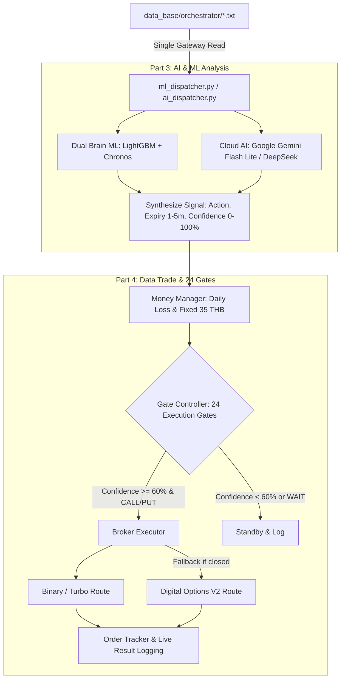

# 🎯 FINALBOT - กระบวนการทำงานของบอท ส่วนที่ 3 & 4: OUTPUT (AI Analysis & Trade Execution)

## 📌 ภาพรวมสถาปัตยกรรม (Overview)
ส่วนงานที่ 3 & 4 (**AI/ML Analysis & Trade Execution**) คือ **"ระบบสมองกลตัดสินใจขั้นสุดท้ายและการบริหารจัดการคำสั่งซื้อขายจริง"** มีหน้าที่รับไฟล์ Prompt Payload มาตรฐาน 99 บรรทัด (.txt) จากส่วนงานที่ 2 (PROCESS) ผ่าน Single Gateway Read Authority เพื่อให้โมเดล Machine Learning และ Cloud AI วิเคราะห์ตัดสินใจเลือกทิศทาง (CALL / PUT / WAIT), กำหนดเวลาหมดอายุ (Expiry 1-5 นาที), คำนวณคะแนนความมั่นใจ (Confidence Score 0-100%) และส่งสัญญาณเข้าสู่ 24 Execution Gates และ Money Management ก่อนยิงคำสั่งซื้อขายจริงสู่โบรกเกอร์

---

## 🏗️ โครงสร้างขอบเขตงานส่วนที่ 3 และ 4 (Workflow Pipeline)



---

## 📋 หน้าที่หลักของแต่ละโมดูล

### 1. Part 3: AI & ML Analysis (`ai_analysis/`)
* **Single Gateway Read Authority (Rule 8):**
  - `ml_dispatcher.py` (สำหรับ Machine Learning) และ `ai_dispatcher.py` (สำหรับ Cloud AI) เป็น 2 โมดูลเดียวที่ได้รับสิทธิ์อ่านไฟล์ 99 บรรทัดจากดิสก์
* **Machine Learning Engine (`ai_analysis/machine_learning/`):**
  - `machine_lightgbm.py`: โมเดล Gradient Boosting สำหรับจัดกลุ่มสัญญาณเทรด
  - `machine_chronos.py`: โมเดล Amazon Chronos Time-series วิเคราะห์แนวโน้มราคาอนาคต
  - `dual_brain.py`: รวมพลังโมเดลคู่ (Ensemble) เพื่อความแม่นยำสูงสุด
* **Cloud Generative AI Engine (`ai_analysis/artificial_intelligence/`):**
  - `gemini_bridge.py`: ตัวเชื่อมต่อ Google Gemini API (Candidate Models: Flash Lite)
  - `deepseek_bridge.py`: ตัวเชื่อมต่อ DeepSeek API
* **มาตรฐานการส่งออกผลลัพธ์ (Output Contract):**
  ```json
  {
    "symbol": "EURUSD",
    "action": "CALL",
    "expiry_minutes": 3,
    "confidence_score": 78.5,
    "reason_th": "แนวโน้ม M5 ขาขึ้นชัดเจน ร่วมกับ M1 Pullback แตะ EMA20 และ RSI เริ่มดีดตัว"
  }
  ```

### 2. Part 4: Data Trade & Execution Gate (`data_trade/`)
* **Money Management (`money_manager.py`):**
  - ล็อกขนาดเงินลงทุนต่อไม้คงที่ตามนโยบายความเสี่ยง (Fixed Stake 35 THB)
  - ควบคุมขีดจำกัดขาดทุนสูงสุดรายวัน (Daily Loss Circuit Breaker)
* **24 Execution Gates Controller (`gate_controller.py`):**
  - ด่านหัวใจชี้ขาด (The Ultimate Execution Gate): **หาก Confidence Score >= 60.0% และเป็น CALL / PUT ➡️ อนุมัติยิงออเดอร์ทันที 100%**
* **Broker Executor (`broker_executor.py`):**
  - เส้นทางหลัก: Binary/Turbo Option บน IQ Option
  - เส้นทางสำรอง: Digital Option V2 Fallback อัตโนมัติเมื่อ Binary ปิดทำการ
* **Order Tracker (`order_tracker.py`):**
  - ติดตามผลลัพธ์การเทรดแบบ Asynchronous เมื่อครบอายุสัญญา (WIN / LOSE / TIE) และบันทึกลง Log รายวินาที

---

## 🛡️ กฎวินัยและความปลอดภัย (Strict Rules)
1. **Part 1 & Part 2 Immutability Rule (Rule 18):** ห้ามแตะต้องโค้ดใน `data_feed/` และ `data_evaluate/` เด็ดขาด 100% พัฒนาต่อยอดได้เฉพาะ Part 3 และ Part 4 เท่านั้น
2. **Single Gateway Read Authority (Rule 8):** การอ่านไฟล์ Prompt 99 บรรทัดต้องทำผ่าน Dispatcher เท่านั้น
3. **Strict 99-Line Compatibility:** สัญญาณทั้งหมดต้องอ้างอิงจากฟิลด์มาตรฐาน 99 บรรทัดที่มี Prefix ครบถ้วน
4. **Foreground Live Verification:** ทดสอบผ่าน `runner.py` และตรวจ Log รายวินาทีจริงเสมอ
