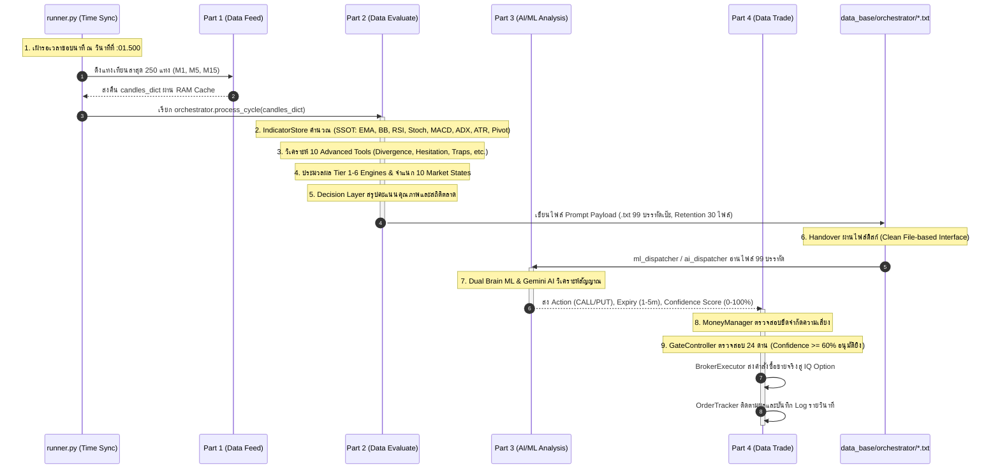

# 🚀 FINALBOT — ระบบเทรดอัตโนมัติอัจฉริยะ (Intelligent Trading Bot System)

---

## 📌 ภาพรวมสถาปัตยกรรมระบบ (System Architecture Overview)

FINALBOT แบ่งโครงสร้างการทำงานออกเป็น 4 ส่วนหลัก (4-Stage Pipeline Architecture) ที่มีความเป็นอิสระและเชื่อมต่อกันด้วยมาตรฐานข้อมูลที่ชัดเจน (Clean Handover):

| ส่วน | ชื่อส่วนงาน | ขอบเขตหน้าที่และความรับผิดชอบหลัก | สถานะ |
|:---|:---|:---|:---:|
| **Part 1** | **Data Feed System** (`data_feed/`) | เชื่อมต่อโบรกเกอร์ (IQ Option) → ซิงค์เวลาเซิร์ฟเวอร์ → ดึงและจัดระเบียบข้อมูล OHLCV (M1, M5, M15) 250 แท่ง → คำนวณ Age (ms) & Quality (`FRESH`/`STALE`) → ดึงปฏิทินข่าวเศรษฐกิจ (Single Daily Calendar) → บันทึก CSV 8 คอลัมน์แบบ Asynchronous Atomic | 🔒 **เสร็จสมบูรณ์ 100% (Immutability)** |
| **Part 2** | **Data Evaluation & Orchestration** (`data_evaluate/`) | รับแท่งเทียนเข้าสู่ RAM → คำนวณ Indicators พื้นฐานผ่าน `IndicatorStore` (SSOT ห้ามคำนวณซ้ำ) → วิเคราะห์ 10 Advanced Tools → ประมวลผล Tier 1-6 Engines & 10 สภาวะตลาด → สร้างไฟล์ Prompt Payload มาตรฐาน 99 บรรทัด (.txt) (Retention 30 ไฟล์) | 🔒 **เสร็จสมบูรณ์ 100% (Immutability)** |
| **Part 3** | **AI & ML Analysis** (`ai_analysis/`) | โมเดล Machine Learning (LightGBM, Chronos, Dual Brain ผ่าน `ml_dispatcher.py`) และ Cloud AI (Gemini Flash Lite, DeepSeek ผ่าน `ai_dispatcher.py`) อ่านไฟล์ 99 บรรทัด → วิเคราะห์ตัดสินใจทิศทาง (CALL/PUT/WAIT), Expiry (1-5 นาที), Confidence Score (0-100%) | 🛠️ **พื้นที่พัฒนาและปรับแต่ง** |
| **Part 4** | **Data Trade & Execution Gate** (`data_trade/`) | ตรวจสอบความเสี่ยง Money Management (Daily Loss, Fixed Stake 35 THB) → คัดกรองผ่าน 24 Execution Gates (คะแนน >= 60% อนุมัติยิงออเดอร์ทันที 100%) → ยิงคำสั่งซื้อขายจริงสู่โบรกเกอร์ (Binary/Digital Fallback) → ติดตามผลลัพธ์และบันทึกประวัติ | 🛠️ **พื้นที่พัฒนาและปรับแต่ง** |

---

## 🏗️ โครงสร้างโฟลเดอร์โปรเจกต์ (Project Directory Tree)

```text
FINALBOT_Begin/
├── main.py                                      # Entry point สำหรับเริ่มต้นระบบ
├── runner.py                                    # หัวใจควบคุมวงรอบหลัก (PureAIRunner) ทำงานรายวินาที
├── .env                                         # Credentials & API Keys
├── .agents/                                     # กฎ วินัย และคู่มือ AI
│   └── AGENTS.md                                # กฎวินัยสูงสุด (Rule 1-22)
├── config_setting/                              # ศูนย์กลางการตั้งค่าระบบ
│   ├── settings.json                            # ตั้งค่าบัญชี, สินทรัพย์ (โหลดตรงอิสระตามสั่งบอส), ขีดจำกัดความเสี่ยง
│   ├── config_loader.py                         # ตัวโหลดการตั้งค่า (SSOT)
│   └── symbol_mapper.json                       # การแปลงชื่อสัญลักษณ์คู่เงิน
├── data_feed/                                   # [Part 1] ระบบรับส่งข้อมูลจากโบรกเกอร์ (🔒 ห้ามแตะต้อง 100%)
│   ├── data_adapter.py                          # Coordinator ประสานงาน Data Feed ทั้งหมด
│   ├── data_processor.py                        # จัดเรียงแท่งเทียน, ตัดแท่งไม่จบ, คำนวณ Age (ms) & Quality
│   ├── data_validator.py                        # ตรวจสอบความถูกต้องของข้อมูล (Zero Mocks, Fail-Fast)
│   ├── data_cache_store.py                      # แคชข้อมูลแท่งเทียนสมบูรณ์ 250 แท่งใน RAM
│   ├── csv_manager.py                           # จัดการโฟลเดอร์และ Path ของ CSV
│   ├── csv_queue.py                             # คิวเขียนไฟล์แบบ Asynchronous Background
│   ├── csv_writer.py                            # เขียนไฟล์ลงดิสก์แบบ Thread-Safe Atomic (.tmp -> replace)
│   ├── csv_time_sync.py                         # ซิงค์เวลาเซิร์ฟเวอร์โบรกเกอร์อัตโนมัติทุกวินาที :30
│   ├── news_calendar.py                         # ดึงปฏิทินข่าวเศรษฐกิจ (Single Daily Calendar Policy)
│   ├── exceptions.py                            # ข้อยกเว้นเฉพาะของระบบ Data Feed
│   └── bridge_adapter/                          # ชุดตัวเชื่อมต่อโบรกเกอร์ (IQ Option, Quotex, Pocket Option)
├── data_evaluate/                               # [Part 2] ระบบสมองกลวิเคราะห์และประเมินข้อมูล (🔒 ห้ามแตะต้อง 100%)
│   ├── orchestrator.py                          # 👑 ผู้คุมวงรอบ 8 ขั้นตอน & สร้างไฟล์ Prompt 99 บรรทัด (Retention: 30 ไฟล์)
│   ├── orchestration/
│   │   ├── indicator_store/                     # คำนวณอินดิเคเตอร์พื้นฐานแบบรวมศูนย์ (SSOT ห้ามคำนวณซ้ำ)
│   │   ├── advanced_tools/                      # 10 เครื่องมือวิเคราะห์พฤติกรรมและ Price Action
│   │   └── market_classifier/                   # Tier 1-6 Engines และ Market State Classifier (10 สภาวะ)
│   └── decision_layer/                          # ชั้นบันทึกผลและส่งต่อสู่ Prompt 99 บรรทัด
├── ai_analysis/                                 # [Part 3] ระบบวิเคราะห์สมองกล AI & ML (🛠️ พื้นที่พัฒนา)
│   ├── machine_learning/                        # โมดูล Machine Learning ภายในเครื่อง
│   │   ├── ml_dispatcher.py                     # Single Gateway อ่านไฟล์ 99 บรรทัดเพื่อรัน ML
│   │   ├── machine_lightgbm.py                  # LightGBM Classifier Model
│   │   ├── machine_chronos.py                   # Amazon Chronos Time-series Model
│   │   └── dual_brain.py                        # รวมพลังสมองกลคู่ (LightGBM + Chronos)
│   └── artificial_intelligence/                 # โมดูล Cloud Generative AI
│       ├── ai_dispatcher.py                     # Single Gateway อ่านไฟล์ 99 บรรทัดเพื่อยิง Cloud AI
│       ├── gemini_bridge.py                     # ตัวเชื่อมต่อ Google Gemini Flash Lite API
│       └── deepseek_bridge.py                   # ตัวเชื่อมต่อ DeepSeek API
├── data_trade/                                  # [Part 4] ระบบควบคุมการเทรดและส่งคำสั่ง (🛠️ พื้นที่พัฒนา)
│   ├── executor_manager.py                      # ตัวประสานงานการเทรดและบันทึกผลลัพธ์
│   └── execution_gate/                          # 24 Execution Gates & Broker Execution
│       ├── gate_controller.py                   # ด่านชี้ขาดการเข้าเทรด (Confidence >= 60% อนุมัติทันที)
│       ├── money_manager.py                     # ควบคุมความเสี่ยงและขนาดเงินลงทุน (Fixed 35 THB)
│       ├── broker_executor.py                   # ยิงคำสั่งเทรดสู่โบรกเกอร์ (Binary & Digital Fallback)
│       └── order_tracker.py                     # ติดตามสถานะและผลแพ้ชนะของออเดอร์
├── data_base/                                   # คลังข้อมูลผลลัพธ์ของระบบ
│   ├── csv/iq_option/                           # ไฟล์ประวัติราคา OHLCV 8 คอลัมน์มาตรฐาน
│   ├── calendar/                                # ไฟล์ปฏิทินข่าวเศรษฐกิจ (รักษา 1 ไฟล์ต่อวันล่าสุด)
│   └── orchestrator/                            # ไฟล์ Prompt Payload (.txt 99 บรรทัด แยกตามคู่เงิน จำกัด 30 ไฟล์)
├── logs/                                        # โฟลเดอร์บันทึก Log รายวินาทีและข้อผิดพลาด
└── docs/                                        # เอกสารคู่มือและสเปกระบบฉบับสมบูรณ์
```

---

## ⚡ ผังการทำงานรายวินาที (Second-by-Second Execution Lifecycle)



---

## 🛡️ 5 เสาหลักกฎวินัยและความปลอดภัย (Core Disciplines)

1. **Part 1 & Part 2 Immutability Rule (Rule 18):**
   - โค้ดในโฟลเดอร์ `data_feed/` และ `data_evaluate/` ถือเป็นรากฐานที่เสร็จสมบูรณ์ 100% แล้ว **ห้ามแก้ไข ดัดแปลง เพิ่ม หรือลบโค้ดโดยเด็ดขาด**
   - พัฒนาต่อยอดได้เฉพาะ Part 3 (`ai_analysis/`) และ Part 4 (`data_trade/`) เท่านั้น
2. **Strict Single Source of Truth & Zero Duplicate Calculations (Rule 10):**
   - ห้ามเขียนโค้ดคำนวณ Indicators หรือสถิติใดๆ ซ้ำซ้อนในโมดูลย่อย ทุกโมดูลต้องดึงค่าอ้างอิงจาก `IndicatorStore` และ `payload` แหล่งเดียวเท่านั้น
3. **Single Gateway Read Authority (Rule 8):**
   - ใน Part 2 มีเพียง `orchestrator.py` เท่านั้นที่รับสิทธิ์อ่านข้อมูลดิบ/รับ `candles_dict`
   - ใน Part 3 มีเพียง `ml_dispatcher.py` และ `ai_dispatcher.py` เท่านั้นที่ได้รับสิทธิ์อ่านไฟล์ Prompt 99 บรรทัดจากดิสก์
4. **Standard 99-Line Explicit Schema & Retention Rule (Rule 20):**
   - ไฟล์ Prompt ที่สร้างออกจากด่าน 2 ต้องมีขนาดคงที่ **99 บรรทัดพอดีเป๊ะ** พร้อม Prefix กำกับชัดเจนทุกตัว (`m1_`, `m5_`, `m15_`, `m5_pa_`, `m5_`, `mtf_`, `dl_`, `ai_`)
   - ระบบจะรักษาไฟล์ไว้ **ไม่เกิน 30 ไฟล์ล่าสุด** ต่อคู่เงิน และลบไฟล์เก่าทิ้งอัตโนมัติ
5. **Single Daily News Calendar Policy (Rule 22):**
   - ระบบจะรักษาไฟล์ปฏิทินข่าวเศรษฐกิจไว้เพียง **1 ไฟล์ต่อวันเท่านั้น** (`calendar_YYYY-MM-DD.txt`) โดยลบไฟล์ข่าวของวันเก่าทิ้งอัตโนมัติเมื่อเริ่มวันใหม่
