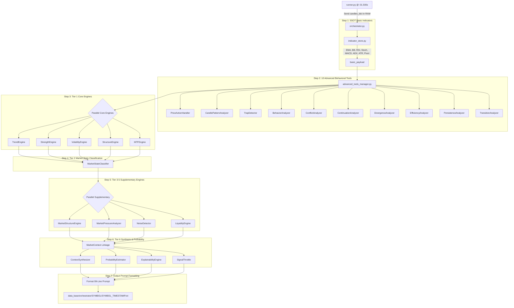

# 🧠 FINALBOT - กระบวนการทำงานของบอท ส่วนที่ 2: PROCESS (Data Evaluate)

## 🎯 ทำความเข้าใจได้ทันที
ส่วนงานที่ 2 (PROCESS) คือ **"สมองกลวิเคราะห์ข้อมูลและมิติพฤติกรรมตลาด"** ที่ตั้งอยู่ในโฟลเดอร์ `data_evaluate/` (🔒 เสร็จสมบูรณ์ 100% - Immutability) มีหน้าที่รับข้อมูลแท่งเทียน (M1, M5, M15) จาก RAM ผ่าน `runner.py` มาคำนวณผ่านอินดิเคเตอร์พื้นฐาน (`IndicatorStore` - SSOT), 10 เครื่องมือวิเคราะห์พฤติกรรมขั้นสูง (Advanced Tools) และระบบ Tier 1-6 Engines เพื่อสร้างเป็น **"แพ็กเกจข้อมูล Prompt Payload ความยาว 99 บรรทัด (.txt)"** สำหรับส่งต่อให้ AI (ส่วนที่ 3) นำไปตัดสินใจ โดยส่วนงานที่ 2 จะทำหน้าที่ "วิเคราะห์และรายงานผล" เท่านั้น จะไม่มีการตัดสินใจยิงออร์เดอร์ใดๆ ทั้งสิ้น

---

## 🏗️ โครงสร้างหลักของโปรเจกต์และขอบเขตส่วนงาน

**โครงสร้างหลักของโปรเจกต์:**
- `runner.py` คือผู้ควบคุมทิศทางและจับจังหวะเวลารายวินาที
- `config_setting/` คือโฟลเดอร์สำหรับเก็บไฟล์การตั้งค่าทั้งหมด
- `data_feed/` คือระบบดึงและตรวจสอบข้อมูล OHLCV (ส่วนที่ 1 🔒 Immutability)
- `data_evaluate/` คือระบบสมองกลประมวลผลข้อมูลและพฤติกรรม (ส่วนที่ 2 🔒 Immutability)
- `ai_analysis/` คือระบบ AI & ML Analysis (ส่วนที่ 3 🛠️ พื้นที่พัฒนา)
- `data_trade/` คือระบบ Execution Gate & Money Management (ส่วนที่ 4 🛠️ พื้นที่พัฒนา)
- `data_base/orchestrator/` คือคลังเก็บไฟล์ผลลัพธ์ Prompt Payload 99 บรรทัด (จำกัด 30 ไฟล์ล่าสุด)

---

## 🚨 กฎการทำงานและกติกาข้อบังคับ (Strict Rules 1 - 22)

1. **Part 1 & Part 2 Immutability Rule (Rule 18):**
   - ห้ามแก้ไข ปรับแต่ง เพิ่ม หรือลบโค้ดใน `data_feed/` และ `data_evaluate/` โดยเด็ดขาด 100%
2. **ดึงข้อมูลจากแหล่งเดียว & ห้ามคำนวณซ้ำซ้อน (SSOT & Zero Duplicate Calculations - Rule 10):**
   - การคำนวณอินดิเคเตอร์พื้นฐานทำที่ `IndicatorStore` ครั้งเดียว แล้วส่งต่อให้โมดูลอื่นใช้งานร่วมกันผ่าน `payload` ไม่มีการคำนวณซ้ำซ้อน
3. **สิทธิ์การอ่านข้อมูลทางเดียว (Single Gateway Read Authority - Rule 8):**
   - ใน Part 2 มีเพียง `orchestrator.py` เท่านั้นที่รับสิทธิ์อ่านข้อมูลดิบ/รับ `candles_dict` จาก `runner.py`
4. **กฎการแตกหัก (Fail-Fast Policy & No Silent Failures):**
   - หากเจอข้อผิดพลาดของข้อมูลหรือคำนวณไม่ได้ ระบบต้องหยุดและแจ้งข้อผิดพลาดทันที ห้ามกลืน Error ด้วย `try-except` ว่างเด็ดขาด
5. **ห้ามมี Mock เด็ดขาด (No Mocks & Real Implementation):**
   - ทุกค่าต้องคำนวณจากคณิตศาสตร์และแท่งเทียนจริง ห้ามใช้ข้อมูลจำลองหรือค่าสุ่มหลอกระบบ
6. **ไม่ใช่ผู้ตัดสินใจขั้นสุดท้าย (Analysis Only - Rule 21):**
   - หน้าที่ของส่วนงานที่ 2 สิ้นสุดเมื่อสร้างเอกสาร Prompt Payload 99 บรรทัดสำเร็จ โดยในหมวด `decision_layer:` จะคงสถานะเป็น "รอการวิเคราะห์จาก AI"

---

## 🏗️ แผนผังสถาปัตยกรรมการประมวลผล 8 ขั้นตอน

---

## 📄 โครงสร้างไฟล์ Prompt Payload 99 บรรทัด (Standard Format)

ไฟล์ผลลัพธ์ที่สร้างขึ้นจะถูกบันทึกที่ `data_base/orchestrator/{SYMBOL}/{SYMBOL}{TIMESTAMP}.txt` โดยมีโครงสร้างมาตรฐาน 99 บรรทัด แบ่งออกเป็น 7 หมวดหมู่หลัก:

1. **`meta:`** (ข้อมูลจำเพาะสินทรัพย์, เวลา, คุณภาพแท่งเทียน `m1_quality`, `m5_quality` ที่เป็น `FRESH` หรือ `STALE`)
2. **`market_context:`** (สภาวะตลาด 10 รูปแบบ `mtf_state`, `mtf_description`, ระดับความผันผวน `m5_volatility_regime`, ผลกระทบข่าวเศรษฐกิจ `m5_news_impact`)
3. **`timeframes:`** (ข้อมูลอินดิเคเตอร์และราคาเปิด/ปิดของ M1, M5, M15 พร้อมคำนำหน้าระบุ Timeframe ชัดเจน เช่น `m1_ema5`, `m5_rsi`, `m15_bias`, `m1_open`, `m5_close`)
4. **`price_action:`** (แพทเทิร์นและจิตวิทยาแท่งเทียน M5 พร้อม Prefix `m5_pa_` เช่น `m5_pa_divergence_alert`, `m5_pa_hesitation_score`, `m5_pa_path_efficiency`)
5. **`volume:`** (ปริมาณซื้อขาย M5 พร้อม Prefix `m5_` เช่น `m5_tick_volume`, `m5_volume_momentum`, `m5_volume_vs_average`)
6. **`analysis:`** (ทิศทางเทรนด์ M5, MTF Alignment, ความเสี่ยงเปลี่ยนสภาวะ เช่น `m5_trend_direction`, `mtf_alignment_%`, `m5_trend_continuation_%`)
7. **`decision_layer:`** (ระดับความเสี่ยง, คะแนนเสถียรภาพ `dl_tradeable`, `dl_stability_score` และ 3 ฟิลด์สุดท้ายรอรับการวิเคราะห์จาก AI `ai_confidence_score`, `ai_suggested_expiry_minutes`, `ai_suggested_action`)

---

## 🛡️ นโยบายการจัดเก็บและทดสอบ (Retention & System Verification)
- **นโยบายการจัดเก็บไฟล์ (Auto Retention Policy - Rule 20):** เพื่อป้องกันพื้นที่จัดเก็บข้อมูลบวม ระบบจะรักษาไฟล์ Prompt Payload ไว้ไม่เกิน **30 ไฟล์ล่าสุดต่อคู่เงิน** โดยระบบจะทำการลบไฟล์ที่เก่าที่สุดทิ้งโดยอัตโนมัติทุกครั้งที่มีการบันทึกรอบใหม่
- **การทดสอบความถูกต้อง:** รันสดผ่าน `runner.py` เท่านั้น
- **ความเร็วในการประมวลผล:** ทำงานเสร็จสิ้นภายใน 0.2-0.5 วินาทีต่อ 4 คู่เงิน
- **ความสมบูรณ์:** ผ่านการทดสอบระดับบรรทัด ไร้จุดคำนวณซ้ำซ้อน และพร้อมส่งต่อให้ Part 3 ใช้งาน 100%
