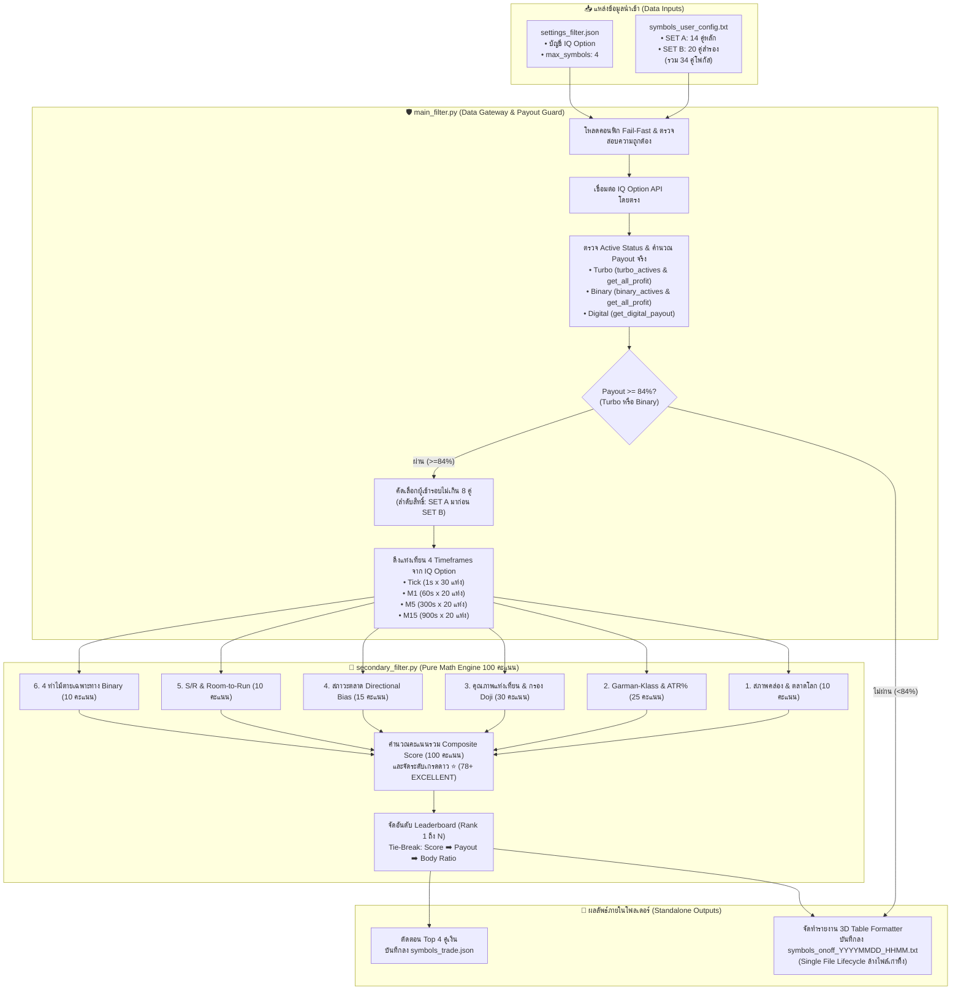

# 🎯 symbols_scanner — ระบบตรวจเช็คและจัดอันดับคู่เงินน่าเทรด 3 มิติ
### (3D Pre-Trade Quantitative Asset Screening & Ranking Gateway)

> **symbols_scanner** คือโมดูลประเมิน คัดกรอง และจัดอันดับคู่เงินก่อนส่งเข้าเทรดจริง (Pre-Trade Quantitative Screening & Ranking) โดยทำหน้าที่เป็น Gateway เชื่อมต่อโบรกเกอร์ IQ Option ตรวจสอบอัตราผลตอบแทน (Payout Guard $\ge 84\%$) ดึงข้อมูลแท่งเทียนหลายไทม์เฟรม (Multi-TF Candles) และคำนวณคะแนนเชิงปริมาณลึก 6 หมวด (100 คะแนนเต็ม) ด้วยขุมพลัง 7 สกิลควอนท์ + 4 ท่าไม้ตายไบนารี่ + ระบบแนวรับ-แนวต้าน เพื่อคัดเลือกคู่เงินที่มีความได้เปรียบทางสถิติสูงสุด (Rank 1 ถึง N)

---

## 🏛️ 1. บทนำและปรัชญาการออกแบบระบบ (Overview & Standalone Principle)

ตามคำสั่งและข้อบังคับเด็ดขาดของบอส ระบบ `symbols_scanner` ได้รับการออกแบบภายใต้หลักการดังนี้:

1. **โมดูล Standalone 100% (แยกขาดอิสระโดยสมบูรณ์):**
   - เป็นเครื่องมือวิเคราะห์และจัดอันดับคู่เงินอิสระ **ไม่ส่งออกข้อมูลไปยังบอทเทรดหลัก**
   - **ห้ามแตะต้องหรือซิงค์ข้อมูล** ไปยัง `config_setting/settings.json` หรือ `config_setting/symbols.json` โดยเด็ดขาด
   - **ไม่มีความเชื่อมโยงกับ `runner.py`** เพื่อให้บอทหลักยังคงโหลดคู่เงินตามที่บอสกำหนดไว้ใน `settings.json` ได้อย่างเสรี 100% ตามกฎข้อที่ 19 (*Unblocked Currency Configuration Rule*)
2. **การบันทึกผลลัพธ์เฉพาะภายในโฟลเดอร์ `symbols_scanner/`:**
   - บันทึก Top picks ลงในไฟล์ `symbols_scanner/symbols_trade.json` เท่านั้น
   - บันทึกรายงานสถานะตลาด 3 มิติฉบับสมบูรณ์ลงใน `symbols_scanner/symbols_onoff_YYYYMMDD_HHMM.txt`
3. **การคัดกรอง 3 มิติ (3D Screening Principles):**
   - **มิติที่ 1: Payout Guard ($\ge 84\%$):** กรองคู่เงินที่มีอัตราผลตอบแทนคุ้มค่าต่อความเสี่ยงคณิตศาสตร์ Binary Options
   - **มิติที่ 2: สภาพคล่องและช่วงเวลาตลาดโลก (Market Session & Liquidity):** คัดคู่เงินที่ตรงกับเวลาทำการหลัก (Tokyo, London, New York) หรือมีกลไก 24/7 OTC Synthetic Engine
   - **มิติที่ 3: คุณภาพแท่งเทียนและพฤติกรรมราคา (Candle Quality & Math Volatility):** ตรวจสอบแท่งเทียนจริง 4 Timeframes คัดกรอง Doji, กราฟนิ่ง, กราฟกระชาก และวัดระยะห่างแนวรับ-แนวต้าน

---

## 🏗️ 2. สถาปัตยกรรมและการไหลของข้อมูล (Mermaid Architecture & Data Flow)

กระบวนการทำงานของโมดูลตัดการซิงค์ออกภายนอกทั้งหมด และประมวลผลข้อมูลตามโฟลว์ที่แท้จริงดังนี้:



---

## ⚙️ 3. การทำงานระดับบรรทัดของ `main_filter.py` (Payout Guard & Data Gateway)

ไฟล์ `main_filter.py` ทำหน้าที่เป็น Single Gateway ควบคุมการเชื่อมต่อเครือข่าย ดึงข้อมูลตลาด และจัดทำรายงานตารางสรุปผล:

### 3.1 การโหลด Focus Symbols จาก `symbols_user_config.txt` (บรรทัดที่ 44 - 70)
- ฟังก์ชัน `load_focus_symbols(file_path: Path) -> Dict[str, List[str]]`
- อ่านไฟล์ข้อความทีละบรรทัด พร้อมระบบกรองคอมเมนต์ (ข้ามบรรทัดว่าง, บรรทัดขีด `-`, และหัวข้อภาษาไทย)
- สลับกลุ่มตามคีย์เวิร์ด:
  - พบ `"SET A"` $\rightarrow$ กำหนดสัญลักษณ์เข้ากลุ่ม `SET_A` (14 คู่หลัก)
  - พบ `"SET B"` $\rightarrow$ กำหนดสัญลักษณ์เข้ากลุ่ม `SET_B` (20 คู่สำรอง)
- ตรวจสอบความถูกต้องของชื่อคู่เงิน: ความยาว $\ge 6$ ตัวอักษร, ไม่มีช่องว่าง, แปลงเป็นตัวพิมพ์ใหญ่ และตัดค่าที่ซ้ำออก

### 3.2 การโหลดคอนฟิกแบบ Fail-Fast จาก `settings_filter.json` (บรรทัดที่ 224 - 265)
- ตรวจสอบการมีอยู่ของไฟล์ `settings_filter.json` หากไม่พบจะ Raise `FileNotFoundError` ทันที (ไม่มีระบบ Fallback ตามกฎเหล็ก)
- ดึงอีเมลและรหัสผ่านจากบล็อก `"account"` หากฟิลด์ใดฟิลด์หนึ่งว่าง จะ Raise `ValueError` ทันที
- โหลดค่า `max_symbols` (ค่ามาตรฐานคือ 4)

### 3.3 การตรวจสถานะ 3 สัญญา และคำนวณ Payout (บรรทัดที่ 73 - 163)
- ฟังก์ชัน `scan_single_symbol(...)` ตรวจสอบ 3 ตัวแทนสัญลักษณ์ของแต่ละคู่: `[sym, f"{sym}-op", f"{sym}-OP"]`
- **Turbo Active Check:** วนลูปตรวจสอบ `turbo_actives` เทียบชื่อตัดคำว่า `front.` ตรวจสอบเงื่อนไข `enabled is True and is_suspended is False`
- **Binary Active Check:** วนลูปตรวจสอบ `binary_actives` เทียบชื่อตัดคำว่า `front.` ตรวจสอบเงื่อนไข `enabled is True and is_suspended is False`
- **Digital Payout Check:** ตรวจสอบผ่าน `api.get_digital_payout(c, seconds=0.3)` เฉพาะสัญญาที่รองรับใน `OP_code.ACTIVES`
- **สูตรการตรวจสิทธิ์เทรดไบนารี่ (Binary Tradable Formula):**
  $$\text{binary\_tradable} = (\text{turbo\_open} \land \text{turbo\_pct} \ge 84.0) \lor (\text{binary\_open} \land \text{binary\_pct} \ge 84.0)$$
  *(หมายเหตุ: แม้สัญญา Digital จะเปิดและมี Payout สูง แต่ระบบจัดอันดับไบนารี่จะพิจารณาเฉพาะช่องทาง Turbo และ Binary เท่านั้นเพื่อความแม่นยำในการส่งคำสั่ง)*
- คัดเลือก Route ที่ให้ผลตอบแทนสูงสุด: `TURBO` > `BINARY` > `DIGITAL`

### 3.4 ลำดับความสำคัญในการคัดเลือก (Priority Queue) (บรรทัดที่ 311 - 320)
- ระบบนำผลการสแกนมาคัดกรองคู่เงินที่ `binary_tradable == True` เพื่อส่งต่อให้ Secondary Filter ไม่เกิน 8 คู่
- **ลำดับสิทธิ์เด็ดขาด:**
  1. วนลูปคัดเลือกจาก `results_set_a` (คู่เงินหลัก) ก่อนจนกว่าจะหมด หรือครบ 8 คู่
  2. หากยังไม่ครบ 8 คู่ จึงวนลูปคัดเลือกเพิ่มเติมจาก `results_set_b` (คู่เงินสำรอง)
  3. ปิดรับผู้เข้ารอบทันทีเมื่อครบ 8 คู่ เพื่อควบคุมภาระการประมวลผลและการยิงคำขอแท่งเทียน

### 3.5 การดึงแท่งเทียน Multi-TF 4 ไทม์เฟรม (บรรทัดที่ 166 - 205)
- ฟังก์ชัน `fetch_multi_tf_candles(api, symbol)` ดึงแท่งเทียนย้อนหลังจาก IQ Option API:
  1. **Tick 1s:** ดึง 30 แท่งล่าสุด (`api.get_candles(symbol, 1, 30, now_ts)`) สำหรับวิเคราะห์ Tick Velocity & Micro-Momentum
  2. **M1 (60s):** ดึง 20 แท่งล่าสุด (`api.get_candles(symbol, 60, 20, now_ts)`) สำหรับวิเคราะห์ Garman-Klass Volatility, Body% และ Doji Rate
  3. **M5 (300s):** ดึง 20 แท่งล่าสุด (`api.get_candles(symbol, 300, 20, now_ts)`) สำหรับวิเคราะห์ Market Trend Bias และ Swing High/Low
  4. **M15 (900s):** ดึง 20 แท่งล่าสุด (`api.get_candles(symbol, 900, 20, now_ts)`) สำหรับวิเคราะห์ Major Multi-TF Structure

### 3.6 ระบบจัดหน้าตารางตรงเป๊ะ Visual Width Formatter (บรรทัดที่ 357 - 401)
- ฟังก์ชัน `get_visual_width(text: str)` และ `pad_visual(text: str, target_width: int)`
- แก้ปัญหาตัวอักษรภาษาไทยและอีโมจิทำให้ตารางเบี้ยวบน Console และ Text File:
  - **Zero-Width Handling:** กำหนดให้สระบน/สระล่าง และวรรณยุกต์ภาษาไทย (รหัส Unicode `0x0E31`, `0x0E34-0x0E3A`, `0x0E47-0x0E4E`) มีความกว้างเป็น 0
  - **Double-Width Handling:** กำหนดให้อีโมจิและสัญลักษณ์พิเศษ (`🔴`, `🟢`, `🟡`, `⚪`, `⭐`, `🏆`, `📌`, `🎯`, `⚡`, `🧬`, `⚠️`) มีความกว้างการแสดงผลเป็น 2 ช่อง
  - เส้นคั่นคอลัมน์ `|` ในรายงานจึงเรียงตัวตรงกัน 100% ทุกบรรทัด

### 3.7 นโยบาย Single File Lifecycle (บรรทัดที่ 228 - 235 และ 439 - 446)
- ก่อนการบันทึกรายงานรอบใหม่ ระบบจะค้นหาและสั่ง `unlink()` ลบไฟล์รายงานเก่าทิ้งทั้งหมด:
  - รูปแบบที่ค้นหา: `symbols_onoff_*.txt`, `symbols_active_*.txt`, `active_symbols*.txt`
  - ทำให้ภายในโฟลเดอร์มีไฟล์รายงาน `symbols_onoff_YYYYMMDD_HHMM.txt` **เพียง 1 ไฟล์ล่าสุดเสมอ** ป้องกันไฟล์ขยะสะสม

### 3.8 การบันทึก `symbols_trade.json` (บรรทัดที่ 451 - 463)
- ดึงเฉพาะ Top N คู่เงิน (ตาม `max_symbols` เช่น 4 คู่) ที่ได้อันดับสูงสุดจากการจัดอันดับ
- บันทึกลงในไฟล์ `symbols_scanner/symbols_trade.json`
- ตรวจสอบและลบไฟล์ `symbols.json` ที่ตกค้างอยู่ในโฟลเดอร์นี้ทิ้งทันที เพื่อคงไว้เฉพาะ `symbols_trade.json` ไฟล์เดียวตามคำสั่งบอส

---

## 🧮 4. การทำงานระดับคณิตศาสตร์และสูตรคำนวณของ `secondary_filter.py`

ไฟล์ `secondary_filter.py` คือ Pure Quantitative Analysis Engine ที่ไม่มีการเชื่อมต่อภายนอก ประมวลผลจากข้อมูลแท่งเทียนดิบ 100% ผ่านระบบคะแนนรวม **100 คะแนนเต็ม** แบ่งเป็น 6 หมวดหลัก:

| หมวดการวิเคราะห์ | สกิลที่เกี่ยวข้อง | คะแนนเต็ม | วัตถุประสงค์หลัก |
| :--- | :--- | :---: | :--- |
| **1. สภาพคล่อง & ตลาดโลก** | `liquidity-analysis` | 10 | คัดเลือกคู่เงินที่มีการซื้อขายหนาแน่นตามเวลาสากล |
| **2. ความผันผวน & สถิติ** | `volatility-modeling`, `pandas-ta` | 25 | คัดกรองระดับความผันผวนที่พอดี ไม่นิ่งสนิทและไม่กระชาก |
| **3. คุณภาพแท่งเทียน & กรอง Noise** | `feature-engineering`, `ta-lib`, `ohlcv-processing` | 30 | ตรวจสอบเนื้อเทียนแน่น กรอง Doji และแท่งราคาค้าง |
| **4. สภาวะตลาด (Market Regime)** | `regime-detection` | 15 | วัดความคมชัดของทิศทางแนวโน้ม (Trend Bias) |
| **5. แนวรับ-แนวต้าน & พื้นที่วิ่ง** | S/R Engine | 10 | ตรวจสอบระยะห่างสู่ Swing High/Low (Room-to-Run) |
| **6. 4 ท่าไม้ตายเฉพาะทาง Binary** | Binary Options Edge | 10 | ดักจับแนวตัวเลขกลม, สปีดของ Tick และโครงสร้าง OTC |
| **คะแนนรวมสุทธิ (Composite Score)** | **Total Quantitative System** | **100** | **เกณฑ์ตัดสินอันดับความน่าเทรด Rank 1 ถึง N** |

---

### 4.1 หมวดที่ 1: สภาพคล่องและช่วงเวลาตลาดโลก (10 คะแนน)
- **สกิล:** `liquidity-analysis` (บรรทัดที่ 36 - 114)
- อ้างอิงช่วงเวลาเปิดทำการ 4 ตลาดสากลตามเวลา UTC (`MARKET_SESSIONS_UTC`):
  - **Sydney (21:00 - 06:00 UTC):** สกุลเงิน `AUD`, `NZD`
  - **Tokyo (00:00 - 09:00 UTC):** สกุลเงิน `JPY`, `AUD`, `NZD`, `SGD`, `HKD`, `CNY`
  - **London (07:00 - 16:00 UTC):** สกุลเงิน `EUR`, `GBP`, `CHF`
  - **New York (12:00 - 21:00 UTC):** สกุลเงิน `USD`, `CAD`
- **เกณฑ์การให้คะแนน:**
  - **กรณีคู่เงิน OTC (`-OTC`):** ได้รับ **10.0 คะแนนเต็ม** ทันที (`HIGH`) เนื่องจากกลไก 24/7 OTC Synthetic Engine มีสภาพคล่องสม่ำเสมอต่อเนื่องตลอดเวลา
  - **กรณีคู่เงินจริง (Real Forex):**
    - ตรวจสอบสกุลเงินหลัก (`curr_a`) และสกุลเงินรอง (`curr_b`) ว่าตรงกับตลาดที่กำลังเปิดหรือไม่
    - ตรวจสอบช่วงเวลา **Peak Overlap (London + New York)** ระหว่าง 12:00 - 16:00 UTC
    - หากเปิดทำการพร้อมกัน $\ge 2$ สกุลเงิน หรืออยู่ในช่วง Peak Overlap และเปิด $\ge 1$ สกุล $\rightarrow$ **10.0 คะแนน** (`HIGH`)
    - หากเปิดทำการ 1 สกุลเงิน $\rightarrow$ **7.0 คะแนน** (`MEDIUM`)
    - หากอยู่นอกเวลาทำการหลักทั้ง 2 สกุลเงิน $\rightarrow$ **3.0 คะแนน** (`LOW`)

---

### 4.2 หมวดที่ 2: ความผันผวนและสูตรคณิตศาสตร์ (25 คะแนน)
- **สกิล:** `volatility-modeling` และ `pandas-ta` (บรรทัดที่ 118 - 190)
- **สูตรคำนวณ Garman-Klass Volatility ($\sigma_{GK}$):**
  โมเดลความผันผวนที่ใช้ข้อมูลทั้ง Open, High, Low, Close เพื่อความแม่นยำสูงสุด:
  $$u = \ln\left(\frac{\max(High, 10^{-6})}{\max(Low, 10^{-6})}\right), \quad v = \ln\left(\frac{Close}{\max(Open, 10^{-6})}\right)$$
  $$\text{Term}_{GK} = 0.5 \cdot u^2 - (2\ln 2 - 1) \cdot v^2$$
  $$\sigma_{GK} = \sqrt{\max\left(0, \frac{1}{N} \sum_{i=1}^N \text{Term}_{GK, i}\right)}$$
- **สูตรคำนวณ Normalized ATR% ($ATR\%$):**
  $$TR_i = \max(High_i - Low_i, |High_i - Close_{i-1}|, |Low_i - Close_{i-1}|)$$
  $$ATR\% = \left(\frac{\frac{1}{N}\sum_{i=1}^N TR_i}{\max(Close_{\text{last}}, 10^{-6})}\right) \times 100$$
- **เกณฑ์การจำแนกสภาวะความผันผวนสำหรับ Binary Options (M1/M5):**
  - **🟢 ผันผวนสุขภาพดี (HEALTHY):** $0.0002 \le \sigma_{GK} \le 0.0035$ $\rightarrow$ ได้ **25.0 คะแนนเต็ม** (แท่งเทียนมีระยะก้าวสม่ำเสมอ ทิศทางไหลลื่น ไม่เสี่ยงต่อการถูกลากกินไส้)
  - **🔴 ผันผวนกระชาก (SPIKY):** $\sigma_{GK} > 0.0035$ $\rightarrow$ ได้ **8.0 คะแนน** (ความผันผวนสูงเกินไป มีแท่งสะบัดยาว เสี่ยงแพ้ในวินาทีสุดท้าย)
  - **⚪ กราฟนิ่งสนิท (DEAD / FLATLINE):** $\sigma_{GK} < 0.0002$ หรือไม่มีข้อมูล $\rightarrow$ ได้ **0.0 คะแนน** (กราฟแทบไม่ขยับ ตลาดไม่มีแรงซื้อขาย เสี่ยงออกผลเสมอหรือติดกับดัก)

---

### 4.3 หมวดที่ 3: คุณภาพแท่งเทียนและการกรอง Noise (30 คะแนน)
- **สกิล:** `feature-engineering`, `ta-lib`, และ `ohlcv-processing` (บรรทัดที่ 192 - 280)
- **ตัวชี้วัดเชิงปริมาณของแต่ละแท่งเทียน:**
  - ช่วงราคาของแท่งเทียน (Candle Range): $R = \max(High - Low, 10^{-6})$
  - ขนาดเนื้อเทียน (Body): $|Close - Open|$
  - อัตราส่วนเนื้อเทียน (Body-to-Range %): $BR\% = \left(\frac{Body}{R}\right) \times 100$
  - ตำแหน่งปิดในกรอบ (Close Position): $CP = \frac{Close - Low}{R}$ (ค่าอยู่ระหว่าง $0.0$ ถึง $1.0$)
  - อัตราส่วนไส้เทียน (Wick Noise Ratio): $WN\% = \left(\frac{(High - \max(O, C)) + (\min(O, C) - Low)}{R}\right) \times 100$
  - เงื่อนไข Doji (ตามมาตรฐาน TA-Lib): แท่งเทียนที่ $BR\% \le 15.0\%$
  - เงื่อนไข Frozen Bar (ตามมาตรฐาน OHLCV Processing): แท่งเทียนที่ $High == Low == Open == Close$
- **โครงสร้างการคิดคะแนนแท่งเทียน (เต็ม 30 คะแนน):**
  1. **คะแนนฐานเนื้อเทียน (Base Body Score: 0 - 25 คะแนน):**
     $$\text{BodyScore} = \min\left(25.0, \frac{\overline{BR\%}}{60.0} \times 25.0\right)$$
     *(หากค่าเฉลี่ยเนื้อเทียน $\ge 60\%$ จะได้คะแนนเต็ม 25 คะแนนทันที)*
  2. **โบนัสแท่งปิดเต็มขอบ (Extreme Close Position Bonus):**
     - หาก $\overline{CP} \ge 0.70$ (ปิดชิดบน แสดงแรงซื้อชนะขาด) หรือ $\overline{CP} \le 0.30$ (ปิดชิดล่าง แสดงแรงขายชนะขาด) $\rightarrow$ ได้โบนัส **+5.0 คะแนน**
     - กรณีทั่วไป $\rightarrow$ ได้โบนัส **+2.0 คะแนน**
  3. **บทลงโทษแท่ง Doji (Doji Penalty):**
     $$\text{DojiPenalty} = \left(\frac{\text{DojiRate\%}}{100.0}\right) \times 20.0$$
  4. **บทลงโทษแท่งราคาค้าง (Frozen Bar Penalty):**
     $$\text{FrozenPenalty} = \text{FrozenCount} \times 10.0$$
  5. **คะแนนสุทธิหมวดแท่งเทียน:**
     $$\text{CandleScore} = \text{clamp}\Big(0.0, 30.0, \text{BodyScore} + \text{CPBonus} - \text{DojiPenalty} - \text{FrozenPenalty}\Big)$$

---

### 4.4 หมวดที่ 4: สภาวะตลาด (Market Regime Detection) (15 คะแนน)
- **สกิล:** `regime-detection` (บรรทัดที่ 282 - 309)
- นับจำนวนแท่งเทียนขาขึ้น ($Close > Open$) และขาลง ($Close < Open$)
- **คำนวณ Directional Trend Bias %:**
  $$\text{Bias\%} = \frac{\max(\text{BullishCount}, \text{BearishCount})}{N} \times 100$$
- **เกณฑ์การให้คะแนน:**
  - **🟢 เทรนด์ชัดเจน (STRONG_TREND):** $\text{Bias\%} \ge 70.0\%$ $\rightarrow$ ได้ **15.0 คะแนนเต็ม** (แท่งเทียนไหลไปในทิศทางเดียวกันอย่างเด่นชัด โมเมนตัมสูง)
  - **🟡 สวิงมีทิศทาง (CLEAN_SWING):** $55.0\% \le \text{Bias\%} < 70.0\%$ $\rightarrow$ ได้ **10.0 คะแนน** (กราฟมีการสวิงตัวแบบมีโครงสร้าง High/Low ที่อ่านง่าย)
  - **⚪ ไซด์เวย์ไร้ทิศทาง (CHOP_NOISE):** $\text{Bias\%} < 55.0\%$ $\rightarrow$ ได้ **3.0 คะแนน** (แท่งเขียวสลับแดงแบบสุ่ม ไม่มีเทรนด์ เกิด False Breakout สูง)

---

### 4.5 หมวดที่ 5: ระบบแนวรับ-แนวต้าน & พื้นที่วิ่ง (Room-to-Run) (10 คะแนน)
- **โมดูล:** S/R Engine (บรรทัดที่ 313 - 364)
- คำนวณจุดสูงสุดและต่ำสุดของรอบสวิงบน M5 หรือ M15:
  $$\text{SwingHigh} = \max_{i=1..N}(High_i), \quad \text{SwingLow} = \min_{i=1..N}(Low_i)$$
- คำนวณระยะห่างไปยังแนวต้านและแนวรับ:
  $$\text{dist\_res} = \max(0, \text{SwingHigh} - \text{Price})$$
  $$\text{dist\_sup} = \max(0, \text{Price} - \text{SwingLow})$$
  $$\text{min\_dist} = \min(\text{dist\_res}, \text{dist\_sup})$$
  $$\text{dist\_pct} = \left(\frac{\text{min\_dist}}{\text{Price}}\right) \times 100$$
- **เกณฑ์การให้คะแนน Room-to-Run Index:**
  - **🟢 มีพื้นที่วิ่งโล่ง (CLEAR):** $\text{dist\_pct} \ge 0.03\%$ $\rightarrow$ ได้ **10.0 คะแนนเต็ม** (ราคามีระยะห่างจากแนวกำแพงมากพอให้ออเดอร์หมดเวลาในโซนกำไร)
  - **🟡 ระยะ S/R ปานกลาง (NORMAL):** $0.008\% < \text{dist\_pct} < 0.03\%$ $\rightarrow$ ได้ **6.0 คะแนน**
  - **🔴 ชิดแนวกำแพง S/R (BARRIER):** $\text{dist\_pct} \le 0.008\%$ $\rightarrow$ ได้ **2.0 คะแนน** (ราคาชนแนวรับ/ต้านเดิม เสี่ยงต่อการ Rejection เด้งสวนทางทำให้ออเดอร์แพ้)

---

### 4.6 หมวดที่ 6: 4 ท่าไม้ตายเฉพาะทาง Binary Options (10 คะแนน)
- **โมดูล:** Exclusive Binary Edges (บรรทัดที่ 366 - 413)
- กำหนดฐานคะแนนเริ่มต้นที่ **10.0 คะแนน** และปรับเพิ่ม/ลดตามพฤติกรรมเฉพาะ:
  1. **Round Number Magnet (.00 / .50 / .80):**
     - คู่เงิน JPY: ตรวจสอบเศษทศนิยม `Price % 1.0` หากห่างจาก `.00`, `.50`, `.80` หรือ `1.00` น้อยกว่า $0.03$ $\rightarrow$ **หัก -4.0 คะแนน** พร้อมติดแท็ก `⚠️ ชิดตัวเลขกลม JPY (.00/.50)`
     - คู่เงิน Non-JPY: ตรวจสอบเลข 3 หลักท้ายของราคา หากลงท้ายด้วย `'000'`, `'500'`, `'800'`, `'00'`, `'50'` $\rightarrow$ **หัก -4.0 คะแนน** พร้อมติดแท็ก `⚠️ ชิดตัวเลขกลม (.00/.50)`
  2. **Tick Velocity & Micro-Momentum (Tick 1s 30 แท่ง):**
     - มีการส่งราคาต่อเนื่อง $\ge 15$ ticks ใน 30 วินาที $\rightarrow$ **บวกเพิ่ม +2.0 คะแนน** พร้อมติดแท็ก `⚡ Tick ไหลต่อเนื่อง`
     - มีการส่งราคาชะลอตัวผิดปกติ $< 5$ ticks $\rightarrow$ **หัก -5.0 คะแนน** พร้อมติดแท็ก `⚠️ Tick ชะลอตัว`
  3. **OTC Step-Ladder Pattern:**
     - ตรวจสอบคุณสมบัติคู่เงิน OTC (`-OTC`) $\rightarrow$ **บวกเพิ่ม +2.0 คะแนน** พร้อมติดแท็ก `🧬 OTC 24/7 Engine`
- ปรับจำกัดคะแนนให้อยู่ในช่วง $[0.0, 10.0]$:
  $$\text{EdgeScore} = \text{clamp}(0.0, 10.0, \text{score})$$

---

### 4.7 ระบบเกรดดวงดาว ⭐ และกลไก Tie-Breaking ในการจัดอันดับ
- รวมคะแนนทั้ง 6 หมวดเข้าด้วยกัน:
  $$\text{TotalScore} = \text{SessionScore} + \text{VolScore} + \text{CandleScore} + \text{RegimeScore} + \text{SRScore} + \text{EdgeScore}$$
  $$\text{TotalScore} \in [0.0, 100.0]$$
- **เกณฑ์การให้เกรดและดวงดาว:**
  - **⭐⭐⭐⭐⭐ EXCELLENT ($\ge 78.0$ คะแนน):** `"🟢 สัญญาณสวยมาก กราฟวิ่งคม เนื้อแน่น พื้นที่โล่ง"`
  - **⭐⭐⭐⭐ GOOD ($\ge 65.0$ คะแนน):** `"🟢 สัญญาณดี กราฟมีทิศทาง ความผันผวนปกติ"`
  - **⭐⭐⭐ FAIR ($\ge 50.0$ คะแนน):** `"🟡 สัญญาณปานกลาง มี Doji หรือไส้กวนบ้าง"`
  - **⚠️ POOR ($< 50.0$ คะแนน):** `"🔴 สัญญาณไม่ดี กราฟนิ่ง/กระชาก หรือติดกำแพง S/R"`
- **กลไกการจัดอันดับ (Tie-Breaking Sorting Key):**
  ในฟังก์ชัน `rank_tradable_symbols` การเรียงลำดับจะใช้ Key 3 ลำดับตามความสำคัญ:
  ```python
  evaluated_list.sort(key=lambda x: (x["score"], x["payout"], x["body_ratio"]), reverse=True)
  ```
  1. **ลำดับที่ 1 (`score`):** คะแนนรวมเชิงปริมาณสูงสุด (100 คะแนน)
  2. **ลำดับที่ 2 (`payout`):** อัตราผลตอบแทนสูงสุด (Payout %)
  3. **ลำดับที่ 3 (`body_ratio`):** สัดส่วนเนื้อเทียนที่แน่นกว่า (Body-to-Range %)

---

## 📁 5. บัญชีรายการไฟล์ทั้งหมดใน `symbols_scanner/`

| ชื่อไฟล์ | ชนิดไฟล์ | หน้าที่และรายละเอียดการทำงาน |
| :--- | :---: | :--- |
| **`main_filter.py`** | Python Script | **Single Gateway & Orchestrator:** โหลด 34 คู่เงินจาก `symbols_user_config.txt`, เชื่อมต่อ IQ Option, กรอง Payout $\ge 84\%$, ดึงแท่งเทียน 4 ไทม์เฟรม, ส่งต่อให้ `secondary_filter.py`, บันทึก `symbols_trade.json` และสร้างรายงาน `symbols_onoff_YYYYMMDD_HHMM.txt` |
| **`secondary_filter.py`** | Python Script | **Pure Quantitative Engine:** คำนวณ Garman-Klass Volatility, ATR%, Body%, Doji Rate, Frozen Bars, Trend Bias, S/R Room-to-Run และ Binary Edges รวม 100 คะแนน และจัดอันดับ Rank 1 ถึง N |
| **`iq_symbols_grabber.py`** | Python Script | **Global Asset Discovery Tool:** เครื่องมือสแกนและจัดหมวดหมู่สินทรัพย์ทั้งกระดานของ IQ Option แยกเป็น 7 หมวด (Forex, Forex OTC, Indices & ETFs, Crypto, Commodities, Stocks, Special OP) ดึงสถานะเปิดเทรดจริง 100% พร้อม Payout บันทึกลง `iq_symbols_MMDDHHMM.txt` |
| **`symbols_user_config.txt`** | Text Config | **Target Asset Universe:** บัญชีรายชื่อ 34 คู่เงินโฟกัสที่บอสกำหนด แบ่งเป็น SET A (14 คู่หลักที่ให้พิจารณาก่อน) และ SET B (20 คู่สำรอง) |
| **`settings_filter.json`** | JSON Config | **Credential & Runtime Config:** จัดเก็บอีเมล/รหัสผ่าน IQ Option และพารามิเตอร์ `max_symbols: 4` (Fail-Fast ไม่มี Fallback) |
| **`symbols_trade.json`** | JSON Output | **Standalone Top Picks:** ผลลัพธ์คู่เงินน่าเทรด Top 4 ที่ผ่านการจัดอันดับรอบล่าสุด บันทึกเฉพาะภายในโฟลเดอร์นี้ |
| **`symbols_onoff_YYYYMMDD_HHMM.txt`** | Text Report | **3D Inspection Report:** รายงานผลการสแกนและตารางจัดอันดับตลาดแบบจัดหน้าตรงเป๊ะ (Single File Lifecycle ล้างไฟล์เก่าทิ้งอัตโนมัติ) |
| **`iq_symbols_MMDDHHMM.txt`** | Text Report | **All-Asset Report:** รายงานสรุปรายการสินทรัพย์ทั้งกระดานที่สร้างจาก `iq_symbols_grabber.py` |
| **`symbols_scanner_readme.md`** | Markdown | **Primary Master Documentation:** เอกสารคู่มือและข้อกำหนดสถาปัตยกรรมฉบับสมบูรณ์ |
| **`readme.md`** | Markdown | **Mirror Documentation:** เอกสารคู่มือฉบับสำเนาคู่ขนาน |
| **`__init__.py`** | Python Package | ตัวเชื่อมต่อโมดูล Expose ฟังก์ชัน `main`, `rank_tradable_symbols`, `evaluate_symbol_comprehensive` |

---

## 🧪 6. วิธีการทดสอบรันแบบ Standalone

### 6.1 การประมวลผล Pure Quantitative Engine (`secondary_filter.py`)
`secondary_filter.py` ทำหน้าที่เป็น Pure Math Engine รับข้อมูลแท่งเทียนจริงจาก `main_filter.py` เท่านั้น โดยไม่มีระบบจำลองหรือ Mock Data ตกค้างตามกฎเหล็ก Fail-Fast


### 6.2 ทดสอบระบบสแกนตลาดจริงและจัดอันดับ (`main_filter.py`)
เชื่อมต่อ IQ Option API จริง สแกน 34 คู่เงิน กรอง Payout $\ge 84\%$ ดึงแท่งเทียน 4 ไทม์เฟรม จัดอันดับ และบันทึกไฟล์รายงาน:
```powershell
python -u symbols_scanner/main_filter.py
```

### 6.3 ทดสอบสำรวจสินทรัพย์ทั้งกระดาน IQ Option (`iq_symbols_grabber.py`)
สแกนรายการสินทรัพย์ทั้งหมดที่เปิดให้เทรดในโบรกเกอร์ แยกเป็น 7 หมวดหมู่:
```powershell
python -u symbols_scanner/iq_symbols_grabber.py
```
